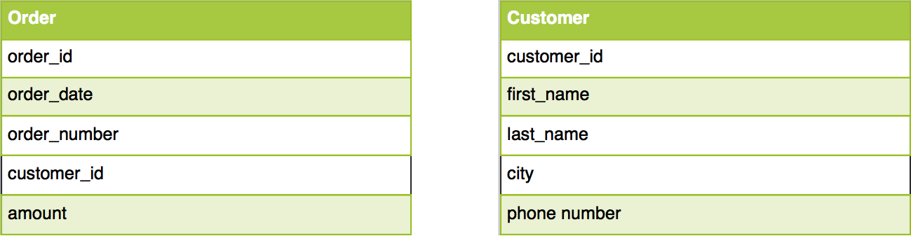
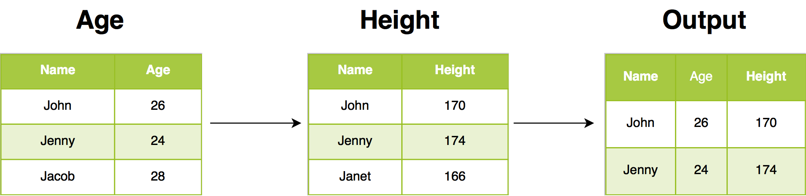
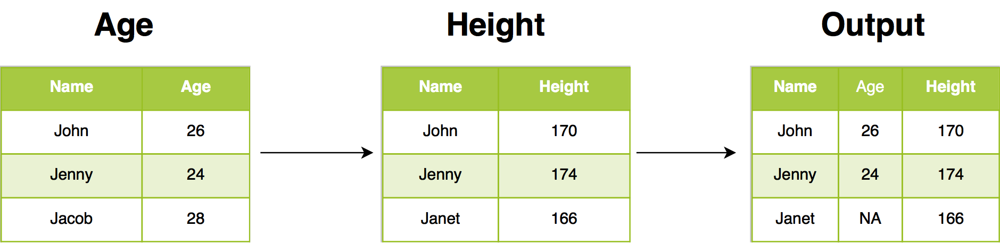
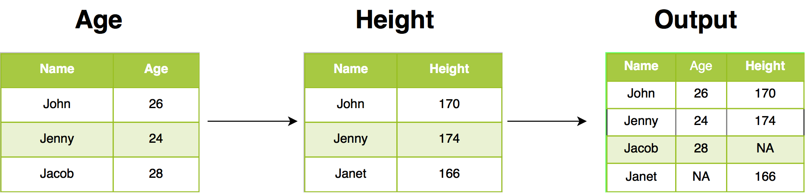

# Data Wrangling - 2 {#dplyr2}

## Introduction

In this chapter, we will learn to combine tables using different `*_join` 
functions provided in dplyr. 

We will use the following R packages:

```{r dplyr1, message=FALSE}
library(dplyr)
library(readr)
options(tibble.width = Inf)
```

## Case Study

For our case study, we will use two data sets. The first one, `order`, contains
details of orders placed by different customers. The second data set, `customer`
contains details of each customer. The below table displays the details stored
in each data set.

```{r img1b, echo=FALSE, out.width="100%", fig.align="center"}

```

Let us import both the data sets using `read_csv`.

### Data: Orders

```{r dplyr2b, message=FALSE}
order <- read_delim('https://raw.githubusercontent.com/rsquaredacademy/datasets/master/order.csv', delim = ';')
order
```

### Data: Customers

```{r dplyr, message=FALSE}
customer <- read_delim('https://raw.githubusercontent.com/rsquaredacademy/datasets/master/customer.csv', delim = ';')
customer
```

We will explore the following in the case study:

- details of customers who have placed orders and their order details
- details of customers and their orders irrespective of whether a customer has 
placed orders or not
- customer details for each order
- details of customers who have placed orders
- details of customers who have not placed orders
- details of all customers and all orders

## Example Data

We will use another data set to illustrate how the different joins work. You can
view the example data sets below.

```{r img2b, echo=FALSE, out.width="100%", fig.align="center"}
knitr::include_graphics("img/join.png")
```

## Inner Join

Inner join return all rows from `Age` where there are matching values in 
`Height`, and all columns from `Age` and `Height`. If there are multiple matches 
between `Age` and `Height`, all combination of the matches are returned.

```{r img3b, echo=FALSE, out.width="100%", fig.align="center"}

```

### Case Study: Details of customers who have placed orders and their order details

To get data for all those customers who have placed orders in the past let us 
join the `order` data with the `customer` data using `inner_join`. 

```{r dplyr3b}
inner_join(customer, order, by = "id")
```

## Left Join

Left join return all rows from `Age`, and all columns from `Age` and `Height`. 
Rows in `Age` with  no match in `Height` will have NA values in the new columns. 
If there are multiple  matches between `Age` and `Height`, all combinations of 
the matches are returned.

```{r img4b, echo=FALSE, out.width="100%", fig.align="center"}
knitr::include_graphics("img/draw_left.png")
```

## Case Study: Details of customers and their orders irrespective of whether a customer has 
placed orders or not.

To get data for all those customers and their orders irrespective of whether a 
customer has placed orders or not let us join the `order` data with the 
`customer` data using `left_join`. 

```{r dplyr4bb}
left_join(customer, order, by = "id")
```

## Right Join

Right join return all rows from `Height`, and all columns from `Age` and 
`Height`. Rows in `Height` with no match in `Age` will have NA values in the 
new columns. If there are multiple matches between `Age` and `Height`, all 
combinations of the matches are returned.

```{r img5b, echo=FALSE, out.width="100%", fig.align="center"}

```

### Case Study: Customer details for each order

To get customer data for all orders, let us join the `order` data with the 
`customer` data using `right_join`. 

```{r dplyr5bb}
right_join(customer, order, by = "id")
```

## Semi Join

Semi join return all rows from `Age` where there are matching values in `Height`, 
keeping just columns from `Age`. A semi join differs from an inner join because 
an inner join will return one row of `Age` for each matching row of `Height`, 
where a semi join will never duplicate rows of `Age`.

```{r img6b, echo=FALSE, out.width="100%", fig.align="center"}
knitr::include_graphics("img/draw_semi.png")
```

### Case Study: Details of customers who have placed orders

To get customer data for all orders where customer data exists, let us join the `order` data with the 
`customer` data using `semi_join`. You can observe that data is returned only for those
cases where customer data is present.

```{r dplyr6bb}
semi_join(customer, order, by = "id")
```

## Anti Join

Anti join return all rows from `Age` where there are not matching values in 
`Height`, keeping just columns from `Age`.

```{r img7b, echo=FALSE, out.width="100%", fig.align="center"}
knitr::include_graphics("img/draw_anti.png")
```

### Case Study: Details of customers who have not placed orders

To get details of customers who have not placed orders, let us join the `order` 
data with the `customer` data using `anti_join`. 

```{r dplyr7bb}
anti_join(customer, order, by = "id")
```

## Full Join

Full join return all rows and all columns from both `Age` and `Height`. Where 
there are not matching values, returns NA for the one missing.

```{r img8b, echo=FALSE, out.width="100%", fig.align="center"}

```

### Case Study: Details of all customers and all orders

To get details of all customers and all orders, let us join the `order` 
data with the `customer` data using `full_join`. 

```{r dplyr8bb}
full_join(customer, order, by = "id")
```