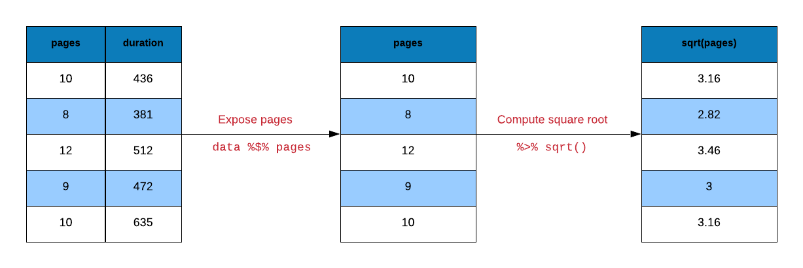
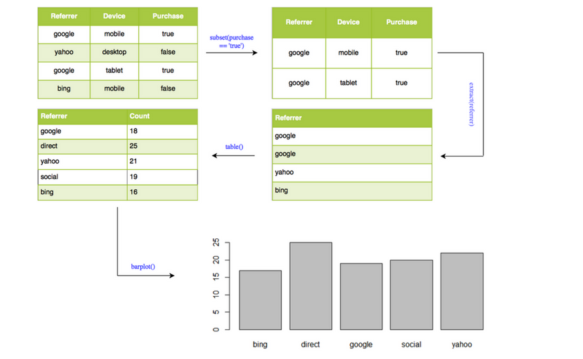
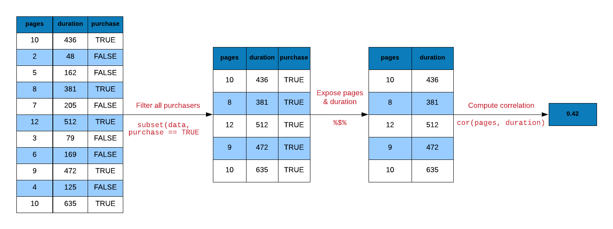
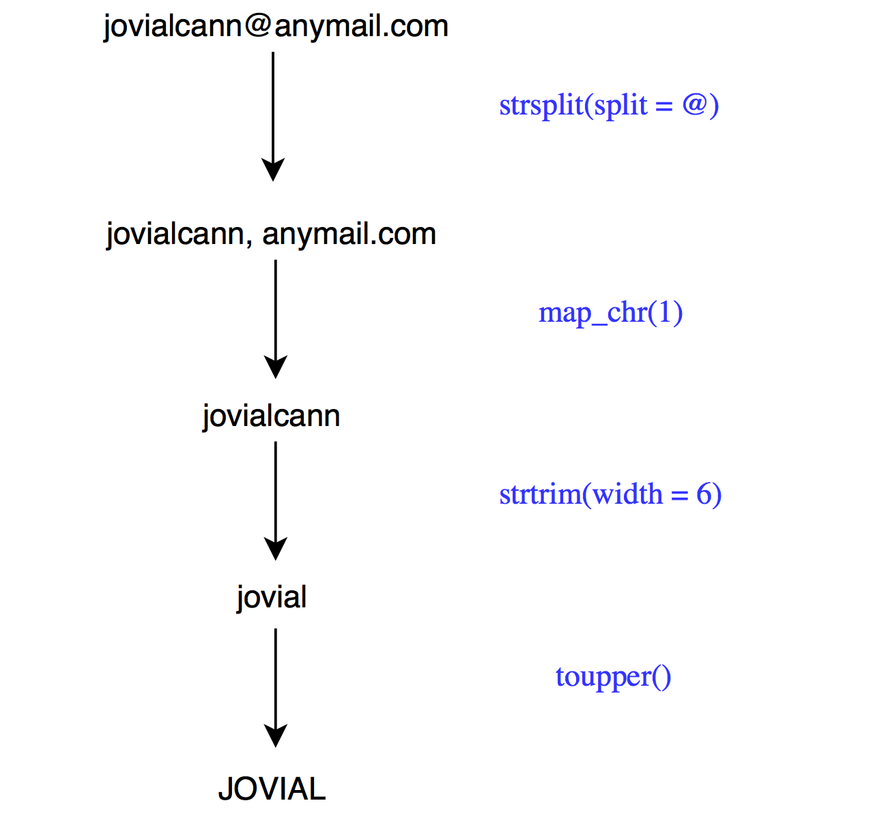

# Pipe Operator {#r-pipe-magrittr}

## Introduction

R code contain a lot of parentheses in case of a sequence of multiple operations. When you are dealing with 
complex code, it results in nested function calls which are hard to read and maintain. The [magrittr](https://CRAN.R-project.org/package=magrittr) package by [Stefan Milton Bache](http://stefanbache.dk/) provides pipes enabling us to write R code that is readable.

Pipes allow us to clearly express a sequence of multiple operations by:

- structuring operations from left to right
- avoiding
    - nested function calls
    - intermediate steps
    - overwriting of original data
- minimizing creation of local variables

## Pipes

The examples in this chapter use the base R pipe `|>`, available in R 4.1 and
later with no extra package. It forwards the value on its left into the first
argument of the function on its right, letting us read a sequence of
operations from left to right (or top to bottom).

> **Legacy note:** older code — including the first edition of this chapter —
> used the magrittr pipe `%>%` and its companions documented in
> `?magrittr::operators`. Those operators are kept only for reading inherited
> code; every example below uses `|>` together with `pull()`/`pluck()` and
> base assignment instead (see the data-extraction section).

We will use the following R packages:

```{r importlib1, message=FALSE}
library(magrittr)
library(readr)
library(dplyr)
library(stringr)
library(purrr)
```

## Data

```{r showed, message=FALSE}
ecom <- 
  read_csv('https://raw.githubusercontent.com/rsquaredacademy/datasets/master/web.csv',
    col_types = cols_only(
      referrer = col_factor(levels = c("bing", "direct", "social", "yahoo", "google")),
      n_pages = col_double(), duration = col_double(), purchase = col_logical()
    )
  )

ecom
```

We will create a smaller data set from the above data to be used in some examples:

```{r show_mini, message=FALSE}
ecom_mini <- slice_sample(ecom, n = 10)
ecom_mini
```

### Data Dictionary

- referrer: referrer website/search engine
- n_pages: number of pages visited
- duration: time spent on the website (in seconds)
- purchase: whether visitor purchased

## head()

Let us start with a simple example. You must be aware of `head()`. If not,
do not worry. It returns the first few observations/rows of data. We can
specify the number of observations it should return as well. Let us use 
it to view the first 10 rows of our data set.

```{r mag1}
head(ecom, 10)
```

### Using Pipe

Now let us do the same but with `|>`. 

```{r mag2}
ecom |> head(10)
```

## Square Root 

Time to try a slightly  more challenging example. We want the square root of 
`n_pages` column from the data set. 

```{r mag3}
y <- sqrt(ecom_mini$n_pages)
```

Let us break down the above computation into small steps:

- select/expose the `n_pages` column from `ecom` data
- compute the square root
- assign the first few observations to `y`

```{r mag24, echo=FALSE, out.width="100%", fig.align="center"}

```

Let us reproduce `y` using pipes.

```{r mag4}
# extract the n_pages column and assign it to y
y <-
  ecom_mini |>
  pull(n_pages)

# compute the square root of y and assign it back to y
y <- sqrt(y)
```

Another way to compute the square root of y is shown below.

```{r mag5}
y <-
  ecom_mini |>
  pull(n_pages) |>
  sqrt()
```

## Visualization

Let us look at a data visualization example. We will create a bar plot to
visualize the frequency of different referrer types that drove purchasers
to the website. Let us look at the steps involved in creating the bar plot:

- extract rows where purchase is TRUE
- select/expose `referrer` column
- tabulate referrer data using `table()`
- use the tabulated data to create bar plot using `barplot()`

```{r mag21, fig.align='center', fig.height=4, fig.width=6}
barplot(table(subset(ecom, purchase)$referrer))
```

### Using pipe

```{r mag26, echo=FALSE, out.width="100%", fig.align="center"}

```

```{r mag7, fig.align='center', fig.height=4, fig.width=6}
ecom |>
  subset(purchase) |>
  pull('referrer') |>
  table() |>
  barplot()
```

## Correlation

Correlation is a statistical measure that indicates the extent to which two or more variables 
fluctuate together. In R, correlation is computed using `cor()`. Let us look at the 
correlation between the number of pages browsed and time spent on the site for
visitors who purchased some product. Below are the steps for computing correlation:

- extract rows where purchase is TRUE
- select/expose `n_pages` and `duration` columns
- use `cor()` to compute the correlation

```{r mag25, echo=FALSE, out.width="100%", fig.align="center"}

```

```{r mag6, collpase = TRUE}
# without pipe
ecom1 <- subset(ecom, purchase)
cor(ecom1$n_pages, ecom1$duration)

# with pipe
ecom |>
  filter(purchase) |>
  summarise(cor = cor(n_pages, duration))
```

## Regression

Let us look at a regression example. We regress time spent on the site on 
number of pages visited. Below are the steps involved in running the regression:

- use `duration` and `n_pages` columns from ecom data
- pass the above data to `lm()`
- pass the output from `lm()` to `summary()` 

```{r mag8}
summary(lm(duration ~ n_pages, data = ecom))
```

### Using pipe

```{r mag22}
ecom |>
  with(lm(duration ~ n_pages)) |>
  summary()
```

## String Manipulation

We want to extract the first name (jovial) from the below email id and
convert it to upper case. Below are the steps to achieve this:

- split the email id using the pattern `@` using `str_split()`
- extract the first element of the resulting list and the first element of
the character vector using `pluck()`
- extract the first six characters using `str_sub()`
- convert to upper case using `str_to_upper()`

```{r mag27, echo=FALSE, out.width="70%", fig.align="center"}

```

```{r mag9}
email <- 'jovialcann@anymail.com'

# without pipe
str_to_upper(str_sub(str_split(email, '@')[[1]][1], start = 1, end = 6))

# with pipe
email |>
  str_split(pattern = '@') |>
  pluck(1, 1) |>
  str_sub(start = 1, end = 6) |>
  str_to_upper()
```

Another method that uses `map_chr()` from the [purrr](https://readr.tidyverse.org/) package.

```{r map39}
email |>
  str_split(pattern = '@') |>
  map_chr(1) |>
  str_sub(start = 1, end = 6) |>
  str_to_upper()
```

## Data Extraction

Let us turn our attention towards data extraction. dplyr and purrr provide
`pull()` and `pluck()` as readable alternatives to `$`, `[` and `[[`:

- `pull()` extracts a column as a vector (like `$`)
- `pluck()` extracts an element from a list or vector (like `[[`)

### Extract Column 

To extract a specific column using the column name, we mention the name 
of the column in single/double quotes within `[` or `[[`. In case of `$`,
we do not use quotes.

```{r mag10}
# base 
ecom_mini['n_pages']

# tidyverse
select(ecom_mini, n_pages)
```

We can extract columns using their index position. Keep in mind that index 
position starts from **1** in R. In the below example, we show how to 
extract `n_pages` column but instead of using the column name, we use the 
column position.

```{r mag23}
# base 
ecom_mini[2]

# tidyverse
select(ecom_mini, 2)
```

One important differentiator between `[` and `[[` is that `[[` will
return an atomic vector and not a `data.frame`. `$` will also return
an atomic vector. In the tidyverse, we use `pull()` in place of `$`.

```{r mag11}
# base 
ecom_mini$n_pages

# tidyverse
pull(ecom_mini, n_pages)
```

### Extract List Element

Let us convert `ecom_mini` into a list using as.list() as shown below:

```{r mag12a}
ecom_list <- as.list(ecom_mini)
```

To extract elements of a list, we use `pluck()`. It is the tidyverse
alternative for `[[`.

```{r mag12}
# base 
ecom_list[['n_pages']]

# tidyverse
pluck(ecom_list, 'n_pages')
```

```{r mag13}
# base 
ecom_list[[1]]

# tidyverse
pluck(ecom_list, 1)
```

We can extract the elements of a list by name using `pluck()` as well.

```{r mag14}
# base 
ecom_list$n_pages

# tidyverse
pluck(ecom_list, "n_pages")
```

## Arithmetic Operations

magrittr offer alternatives for arithemtic operations as well. We will look at 
a few examples below.

- `add()`
- `subtract()`
- `multiply_by()`
- `multiply_by_matrix()`
- `divide_by()`
- `divide_by_int()`
- `mod()`
- `raise_to_power()`

### Addition

```{r mag15}
1:10 + 1

add(1:10, 1)

`+`(1:10, 1)
```

### Multiplication

```{r mag16}
1:10 * 3

multiply_by(1:10, 3)

`*`(1:10, 3)
```

### Division

```{r mag17}
1:10 / 2

divide_by(1:10, 2)

`/`(1:10, 2)
```

### Power

```{r mag18}
1:10 ^ 2

raise_to_power(1:10, 2)

`^`(1:10, 2)
```

## Logical Operators

There are alternatives for logical operators as well. We will look at 
a few examples below.

- `and()`
- `or()`
- `equals()`
- `not()`
- `is_greater_than()`
- `is_weakly_greater_than()`
- `is_less_than()`
- `is_weakly_less_than()`

### Greater Than

```{r mag19}
1:10 > 5

is_greater_than(1:10, 5)

`>`(1:10, 5)
```

### Weakly Greater Than

```{r mag20}
1:10 >= 5

is_weakly_greater_than(1:10, 5)

`>=`(1:10, 5)
```