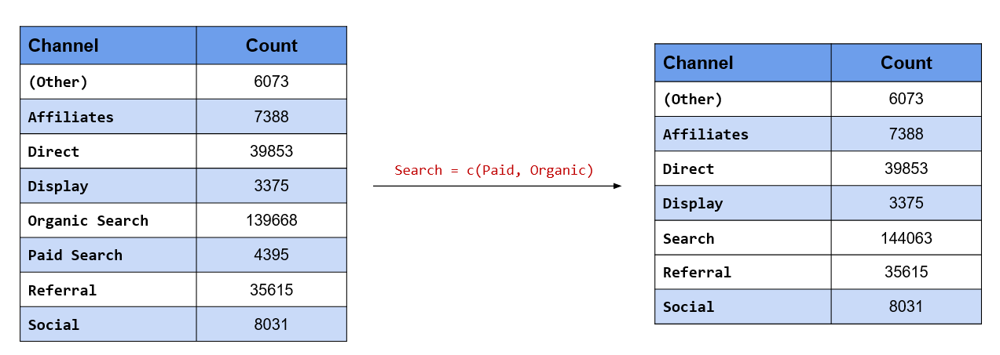
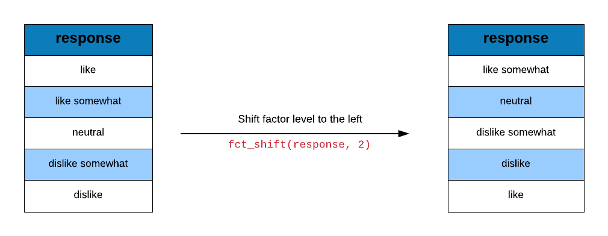

# Categorical Data Analysis {#forcats}

## Introduction

In this chapter, we will learn to work with categorical/qualitative data in R 
using [forcats](https://forcats.tidyverse.org). Let us begin by installing 
and loading forcats and a set of other pacakges we will be using.

```{r cat1, message=FALSE}
library(forcats)
library(tibble)
library(magrittr)
library(purrr)
library(dplyr)
library(ggplot2)
library(readr)
```

## Case Study

We will use a case study to explore the various features of the forcats 
package. You can download the data for the case study from 
[here](https://raw.githubusercontent.com/rsquaredacademy/datasets/master/web.csv) 
or directly import the data using the readr package. We will do the following 
in this case study:

- compute the frequency of different referrers
- plot average number of pages browsed for different referrers
- collapse referrers with low sample size into a single group
- club traffic from social media websites into a new category
- group referrers with traffic below a threshold into a single category
 
### Data

```{r showd, message=FALSE}
ecom <- 
  read_csv('https://raw.githubusercontent.com/rsquaredacademy/datasets/master/web.csv',
    col_types = cols_only(
      referrer = col_factor(levels = c("bing", "direct", "social", "yahoo", "google")),
      n_pages = col_double(), duration = col_double()
    )
  )

ecom
```

Let us extract the `referrer` column from the above data using `use_series` 
and save it in a new variable `referrers`. Instead of using ecom which is 
a tibble, we will use `referrers` which is a vector. We do this to avoid 
extracting the `referrer` column from the above data in later examples.

```{r show2d}
referrers <- use_series(ecom, referrer)
```

## Tabulate Referrers

Let us look at the traffic driven by different referrer types.

```{r img1e, echo=FALSE, out.width="100%", fig.align="center"}

```

```{r cat2}
fct_count(referrers)
```

If you want to sort the output in descending order, use `sort` and set it to `TRUE`.

```{r cat2a}
fct_count(referrers, sort = TRUE)
```

Use `fct_unique` to view the categories or levels of the referrer variable.

```{r cat22}
fct_unique(referrers)
```

## Reorder Referrers

We want to examine the average number of pages visited by each referrer type. 

```{r cat3}
refer_summary <- 
  ecom %>%
  group_by(referrer) %>%
  summarise(
    page = mean(n_pages),
    tos = mean(duration),
    n = n()
  )

refer_summary
```

Let us plot the average number of pages visited by each referrer type. 

```{r cat10, fig.align='center', fig.width=6, fig.height=4}
refer_summary %>%
  ggplot() +
  geom_point(aes(page, referrer))
```

Use `fct_reorder` to reorder the referrer types by the average number of pages
visited.

```{r cat11, fig.align='center', fig.width=6, fig.height=4}
refer_summary %>%
  ggplot() +
  geom_point(aes(page, fct_reorder(referrer, page)))
```

## Plot Referrer Frequency (Descending Order)

Since we want to plot the referrers in descending order of frequency, we will
use `fct_infreq()` to reorder by frequency.

```{r img2e, echo=FALSE, out.width="100%", fig.align="center"}
knitr::include_graphics("img/fct_infreq.png")
```

```{r cat23}
referrers %>%
  fct_infreq() %>%
  fct_unique()
```

Now that we know how to reorder categories/levels by frequency, let us reorder
the referrers by frequency and plot them.

```{r cat4, fig.align='center', fig.width=6, fig.height=4}
ecom %>%
  mutate(
    ref = referrer %>% 
      fct_infreq()
  ) %>%
  ggplot(aes(ref)) +
  geom_bar()
```

## Plot Referrer Frequency (Ascending Order)

Let us look at the categories of the referrer variable. 

```{r cat24}
fct_unique(referrers)
```

Since we want to plot the referrers in ascending order of frequency, we will 
use `fct_rev()` to reverse the order.

```{r img3e, echo=FALSE, out.width="100%", fig.align="center"}
knitr::include_graphics("img/fct_rev.png")
```

```{r cat25}
referrers %>%
  fct_rev() %>%
  fct_unique()
```

Let us reorder the referrers by frequency first and then reverse the order 
before plotting their frequencies.

```{r cat5, fig.align='center', fig.width=6, fig.height=4}
ecom %>%
  mutate(
    ref = referrer %>% 
      fct_infreq() %>% 
      fct_rev()
  ) %>%
  ggplot(aes(ref)) +
  geom_bar()
```

## Case Study 2

In this case study, we will learn to:

- combine categories
- recategorize 

The data set we will use has just one column `traffics` i.e. the source
of traffic for a imaginary website.

### Data 

```{r import2e, message=FALSE}
traffic <- 
  read_csv('https://raw.githubusercontent.com/rsquaredacademy/datasets/master/web_traffic.csv',
    col_types = list(
      col_factor(levels = c("affiliates", "bing", "direct", "facebook", 
        "yahoo", "google", "instagram", "twitter", "unknown")
      )
    )
  )

traffic
```

Let us extract the `traffics` column from the above data using `use_series` 
and save it in a new variable `traffics`. Instead of using traffic which is 
a tibble, we will use `traffics` which is a vector. We do this to avoid 
extracting the `traffics` column from the above data in all the examples 
shown below.

```{r import2ae}
traffics <- use_series(traffic, traffics)
```

## Tabulate Referrer

Let us compute the traffic driven by different referrers using `fct_count`.

```{r cat6}
fct_count(traffics)   
```

## Collapse Referrer Categories

We want to group some of the referrers into 2 categories:

- social
- search

To group categories/levels, we will use `fct_collapse()`.

```{r img4e, echo=FALSE, out.width="100%", fig.align="center"}

```

```{r cat7}
traffics %>%
  fct_collapse(
    social = c("facebook", "twitter", "instagram"),
    search = c("google", "bing", "yahoo")
  ) %>% 
  fct_count()
```

The above result can be achieved using `fct_recode()` as shown below:

```{r img10e, echo=FALSE, out.width="100%", fig.align="center"}
knitr::include_graphics("img/fct_recode.png")
```

```{r recode}
fct_recode(traffics, 
  search = "bing", 
  search = "yahoo", 
  search = "google",
  social = "facebook", 
  social = "twitter", 
  social = "instagram") %>%
  levels()
```

## Lump Infrequent Referrer Types

Let us group together referrer types that drive low traffic to the website.
Use `fct_lump()` to lump together categories.

```{r img5e, echo=FALSE, out.width="100%", fig.align="center"}
knitr::include_graphics("img/fct_lump_1.png")
```

```{r cat8, collapse = TRUE}
fct_count(traffics)

traffics %>% 
  fct_lump() %>% 
  table()
```

## Retain top 3 referrers

We want to retain the top 3 referrers and combine the rest of them into a
single category.

```{r cat9, echo=FALSE}
traffics %>%
  fct_count() %>% 
  arrange(desc(n))
```

Use `fct_lump()` and set the argument `n` to `3` indicating we want to
retain top 3 categories and combine the rest.

```{r cat17}
traffics %>% 
  fct_lump(n = 3) %>% 
  table()
```

## Lump Referrer Types with less than 10% traffic

Let us combine referrers that drive less than 10% traffic to the website.

```{r img6e, echo=FALSE, out.width="100%", fig.align="center"}

```

```{r cat12, echo=FALSE}
fct_count(traffics) %>%
  mutate(
    percent = round((n / sum(n)) * 100, 2)
  )
```

Since we are looking at proportion of traffic driven to the website and
not the actual numbers, we use the `prop` argument and set it to `0.1`,
indicating that we want to retain only those categories which have a
proportion of more than 10% and combine the rest.

```{r cat16}
traffics %>%
  fct_lump(prop = 0.1) %>% 
  table()
```

## Retain 3 Referrer Types with lowest traffic

What if we want to retain 3 referrers which drive the lowest traffic 
to the website and combine the rest? 

```{r cat14, echo=FALSE}
traffics %>%
  fct_count() %>% 
  arrange(n)
```

We will still use the `n` argument but instead of specifying `3`, we now specify `-3`. 

```{r cat19}
traffics %>% 
  fct_lump(n = -3) %>% 
  table()
```

## Retain 3 Referrer Types with less than 10% traffic

Let us see how to retain referrers that drive less than 10 % traffic to 
the website and combine the rest into a single group. 

```{r cat15, echo=FALSE}
traffics %>%
  fct_count() %>%
  mutate(
    percent = round((n / sum(n)) * 100, 2)
  )
```

Instead of setting `prop` to `0.1`, we will set it to `-0.1`.

```{r cat20}
traffics %>% 
  fct_lump(prop = -0.1) %>% 
  table()
```

## Replace Levels

```{r img8e, echo=FALSE, out.width="100%", fig.align="center"}
knitr::include_graphics("img/fct_others_1.png")
```

Let us assume we want to retain a couple of important categories and group
the rest into a single category. In the below example, we retain *google* and
*yahoo* while grouping the rest as others using `fct_other()`. 

```{r other_1}
fct_other(traffics, keep = c("google", "yahoo")) %>%
  levels()
```

## Drop Levels

```{r img9e, echo=FALSE, out.width="100%", fig.align="center"}
knitr::include_graphics("img/fct_others_2.png")
```

What if you want to drop a couple of categories instead of grouping them? 
Use the `drop` argument in `fct_other()` and specify the categories to be
dropped. In the below example, we drop the following referrer categories:

- instagram
- twitter

```{r other_2}
fct_other(traffics, drop = c("instagram", "twitter")) %>%
  levels()
```

## Reorder Levels

The categories can be reordered using `fct_relevel()`. In the above example, 
we reorder the categories to ensure *google* appears first. Similarly in 
the below example, we reorder the levels to ensure *twitter* appears first
irrespective of its frequency or order of appearance in the data.

```{r img11e, echo=FALSE, out.width="100%", fig.align="center"}
knitr::include_graphics("img/fct_relevel_1.png")
```

```{r relevel_1}
fct_relevel(traffics, "twitter") %>%
  levels()
```

If the category needs to appear at a particular position, use the `after` 
argument and specify the position after which it should appear. For example,
if *google* should be the third category, we would specify `after = 2` i.e.
*google* should come after the 2nd position (i.e. third position).

```{r img12e, echo=FALSE, out.width="100%", fig.align="center"}
knitr::include_graphics("img/fct_relevel_2.png")
```

```{r relevel_2}
fct_relevel(traffics, "google", after = 2) %>%
  levels()
```

If the category should appear last, supply the value `Inf` (infinity) to the
`after` argument as shown below.

```{r img13e, echo=FALSE, out.width="100%", fig.align="center"}
knitr::include_graphics("img/fct_relevel_3.png")
```

```{r relevel_3}
fct_relevel(traffics, "facebook", after = Inf) %>%
  levels()
```

## Case Study 3

In this case study, we deal with categorical data which is ordered and cyclical. 
It contains response to an imaginary survey.

### Data 

```{r import3ae, echo=TRUE, message=FALSE}
response_data <- 
  read_csv('https://raw.githubusercontent.com/rsquaredacademy/datasets/master/response.csv',
    col_types = list(col_factor(levels = c("like", "like somewhat", "neutral", 
      "dislike somewhat", "dislike"), ordered = TRUE)
    )
  )
```

Since we will be using only one column from the above data set, let us extract it using
`use_series()` and save it as `responses`.

```{r import2ne}
responses <- use_series(response_data, response)
levels(responses)
```

## Shift Levels

To shift the levels, we use `fct_shift()`. Use the `n` argument to indicate 
the direction of the shift. If `n` is positive, the levels are shifted to 
the left else to the right. In the below example, we shift the levels to 
the left by 2 positions.

```{r img14e, echo=FALSE, out.width="100%", fig.align="center"}

```

```{r shift_1}
fct_shift(responses, 2) %>%
  levels()
```

To shift the levels to the right, supply a negative value to the `n` argument
in `fct_shift()`. In the below example, we shift the levels to the right by 
2 positions. 

```{r img15e, echo=FALSE, out.width="100%", fig.align="center"}

```

```{r shift_2}
fct_shift(responses, -2) %>%
  levels()
```