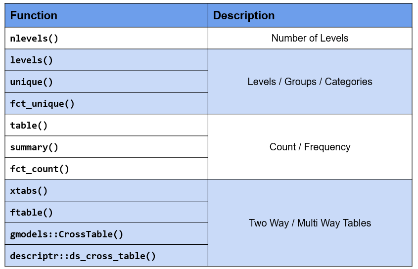
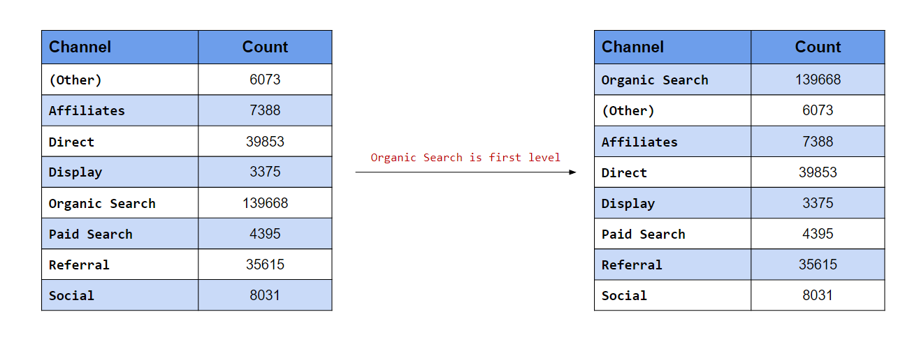
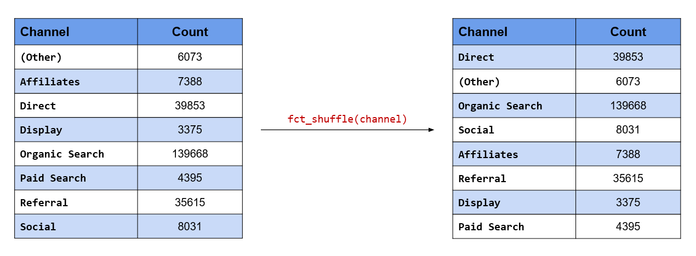

# Categorical Data in R {#categorical-data-in-r}

## Introduction {#intro}

```{r pkg_loads, echo=FALSE, message=FALSE, warning=FALSE}
library(knitr)
library(kableExtra)
library(magrittr)
library(forcats)
library(readr)
library(dplyr)
library(ggplot2)
library(ggmosaic)
library(ggpubr)
library(plotrix)
```

Handling categorical/qualitative data is integral to data analysis.  Almost every data science project involves working with categorical data and students should know how to store, summarize, visualize & manipulate such data. Working with categorical data is different from working with numbers or text. In this chapter, we will understand categorical data and explore the rich set of functions (built-in & through packages) provided by R for working with such data. The word categorical is used interchangeably with qualitative.

### Data Types

Before we begin our deep dive on categorical data, let us get a quick overview of different data types.

```{r data_types, echo=FALSE, fig.align="center", out.width="80%"}

```

In the chart above, we can see that data can be primarily classified into **qualitative** or **quantitative**. Qualitative data consists of labels or names. Quantitative data, on the other hand, consists of numbers and indicate how much or how many. This brings us to the next level of classification:

- discrete
- continuous

In the chart, we can observe that qualitative data is always **discrete** where as quantitative data may be **discrete** or **continuous**. Qualitative data is further classified into 

- nominal
- ordinal

First, we will understand discrete and continuous data, and then proceed to explore nominal and ordinal data.

**Discrete Data**

```{r discrete_data, echo=FALSE, fig.align="center", out.width="80%"}

```

Discrete data arises in situations where counting is involved. It can take on only a finite number of values and cannot be divided into smaller parts. For example, let us consider the number of students in a class. We can have 5 0r 10 students but not 5.5 students (we can't have half a student).

**Continuous Data**

```{r continuous_data, echo=FALSE, fig.align="center", out.width="80%"}

```

Continuous data arises in situations where measuring is involved. It can take any numeric value in a specified range and can be divided into smaller parts and still have meaning. Examples include money, temperature, length, volume etc.

### Categorical Data

Since our interest is in categorical data, we will spend more time understanding the different types of categorical data through various examples. Let us begin by formally defining categorical data:

- it is always discrete
- it may be divided into groups
- consists of names or labels
- takes on limited & fixed number of possible values
- arises in situation when counting is involved
- analysis generally involves the use of data tables

### Dichotomous

A categorical variable that can take on exactly two values is termed as **binary** or **dichotomous** variable.

```{r dichotomous_data, echo=FALSE, fig.align="center", out.width="80%"}
knitr::include_graphics("img/fct_yes_no.png")
```

### Polychotomous

Categorical variables with more than two possible values are called **polychotomous** variables.

```{r polychotomous_data, echo=FALSE, fig.align="center", out.width="80%"}
knitr::include_graphics("img/fct_yes_no_maybe.png")
```

### Ordinal 

```{r ordinal_data, echo=FALSE, fig.align="center", out.width="80%"}
knitr::include_graphics("img/fct_satisfaction_rating.jpg")
```

In ordinal data, the categories can be ordered or ranked. Examples include

- socio-economic status
- education level
- income level
- satisfaction rating

While we can rank the categories, we cannot assign a value to them. For example, in satisfaction ranking, we cannot say that like is twice as positive as dislike i.e. we are unable to say how much they differ from each other.
While the order or rank of data is meaningful, the difference between two pieces of data cannot be measured/determined or are meaningless. Ordinal data provide information about relative comparisons, but not the magnitude of the differences.

### Nominal 

```{r nominal_data, echo=FALSE, fig.align="center", out.width="80%"}
knitr::include_graphics("img/fct_transportation_mode.png")
```

Nominal data do not have an intrinsic order and cannot be ordered or measured. Examples include 

- blood group
- gender
- religion
- color

Categorical data are sometimes coded with numbers, with those numbers replacing names. Although such numbers might appear to be quantitative, they are actually categorical data. When they do take numerical values, those numbers do not have any mathematical meaning. Examples include months expressed in numbers.

### Summary

- Data can be qualitative or quantitative.
- Qualitative data is always discrete.
- Dichotomous data consists of only 2 groups/levels.
- Polychotomous data consists of more than 2 groups/levels.
- Nominal data do not have an intrinsic order.
- In ordinal data
    - categories can be ordered or ranked
    - the difference between the categories cannot be determined

### Your Turn...

1. State whether the following are quantitative or qualitative

- Age
- Gender
- Annual Sales
- Weight
- Education Level
- Vehicle Type
- Height
- Ice Cream Flavor
- Job/Work Experience
- Blood Group
- Color 
- Mode of Payment

2. State whether the following are dichotomous or polychotomous

- Heads / Tails
- Blood Group
- Transportation Mode
- Rich / Poor
- Democrat / Republican
- Education Level
- Gender
- Pass / Fail
- Yes / No
- Positive / Negative

3. State whether the following are nominal or ordinal

- STD Codes
- Prepaid / Postpaid 
- Hotel Ratings
- Smart Phone Brands
- Student Grades
- Cellular Operator
- ISPs (Internet Service Providers)
- Occupation
- Bank Account Number
- Class of Travel
- Military Rank    

## Case Study {#casestudy}

As is the practice, throughout this chapter, we will work on a case study related to an e-commerce firm. As most of you would already be aware, a lot of data is captured when you go on the internet by the websites you browse as well as by third party cookies. Data collected is then used to display ads as well as to feed to recommendation algorithms.

The data used in the case study represents the basic information that is captured when users visit any
website. It closely resembles real world data for an e-commerce store. We will try to generate insights
about the visitors to be used by an imaginary marketing team for better targeting and promotion. The case study data set can be imported using the RStudio IDE or R code. 

```{r case_study, echo=FALSE, fig.align="center", out.width="80%"}
knitr::include_graphics("img/fct_web_analytics.png")
```

### Data

The data set is available in both **CSV** & **RDS** formats.

**CSV**

If you want to specify the data types while reading the data, use the [readr](https://readr.tidyverse.org/) package. We have explored how to import data into R in a previous [chapter](#import1). We will read a subset of columns from the data set (it has 20 columns) which will cover both nominal and ordinal data types. To import the data, we will use the `read_csv()` function. The first input is the name of the data set,
`analytics.csv`. Ensure that the name is enclosed in single/double quotes.

```{r read_data}
read_csv("analytics_raw.csv", 
         col_types = cols_only(device = col_factor(levels = c("Desktop", "Tablet", "Mobile")), 
                               gender = col_factor(levels = c("female", "male", "NA")), 
                               user_rating = col_factor(levels = c("1", "2", "3", "4", "5"),
                                                        ordered = TRUE)))
```

Since we are specifying the column data types while importing the data, we will use the `col_types`
argument to list out the data types. As we are reading in a subset of the columns and not all of them,
we will use the `cols_only()` function indicating that only the columns specified must be read in and not
all of them. 

Categorical data and the levels/groups are specified using the `col_factor()` function. Use the
`levels` argument to specify the levels/groups and the `ordered` argument to indicate if the data is ordinal. By default, it is set to `FALSE`, change this to `TRUE` if the column is ordinal.

**RDS**

The `.rds` file can be read using `readRDS()`.

```{r imports}
data <- readRDS('analytics.rds')
head(data)
```

### Data Dictionary

```{r data_dictionary, echo=FALSE}
fname   <- c("device", "os", "browser", "user_type", "channel", "gender",
             "frequency", "recency", "page_depth", "hour_of_day", "age",
             "duration", "landing_page", "exit_page", "country", "city",
             "quantity", "revenue", "purchase_flag", "user_rating")
descrip <- c("Device used to browse the website",
             "Operating system of the device", 
             "Browser used to visit the website",
             "New or returning visitor",
             "Source of traffic",
             "Gender of the visitor",
             "Count of visits to the website",
             "Number of days since last visit",
             "Number of website pages browsed",
             "Hour of day",
             "Age of the visitor",
             "Time spent on the website (in seconds)",
             "Page on which visitor landed",
             "Page on which visitor exited",
             "Country of origin", 
             "City of the visitor",
             "Number of units purchased",
             "Total revenue",
             "Whether the visitor checked out?",
             "Website UI rating given by visitor")
data.frame(Column = fname, Description = descrip) %>% 
  kable() %>% 
  kable_styling(
    bootstrap_options = c("striped", "hover", "condensed", "responsive")
  )
```

## Factors {#factors}

In this very important section, we will learn how R

- stores categorical data
- checks if given data is categorical
- converts other data types to factor
- handles missing values in categorical data
- specifies the orders of the categories/levels
- stores ordinal data

### Introduction

In R, categorical data is stored as `factor`. Before we explore the `factor` family of functions, let us generate the sample data we will use in this module. We will generate the `device` column from the case study data set using the `sample()` function. We provide the following inputs to generate the data:

- values from which the data must be generated
- the size of the sample
- indicate if the values must be repeated (TRUE/FALSE)

```{r factor_1}
device <- sample(c("Desktop", "Mobile", "Tablet"), size = 25, replace = TRUE)
device
```

### Membership Testing

Great! We have successfully generated the sample data and along the way learnt a new R function for sampling. First, let us check if the sample is a `factor` using the membership function `is.factor()`.

```{r factor_2}
is.factor(device)
```

Membership testing functions always have the prefix `is_` and return only logical values. If the object is a member of the specified class, they return `TRUE` else `FALSE`. Since our sample data is not stored as a factor, R has returned `FALSE`.

### Coercion

Let us try to coerce it into `factor` using the coercion function `as.factor()`.

```{r factor_3}
as.factor(device)
```

Do you spot any difference in the output? In the last line, it displays the levels or categories of the variable. Don't worry if you didn't spot it. We are just getting started and you will pick it up by the end of this section. Another function that can be used to coerce data into factor is `as_factor()` from the [forcats](https://forcats.tidyverse.org/) package.

```{r factor_4}
as_factor(device)
```

Did you notice any difference between these two functions? Focus on the last line of the output where the
levels are displayed. Now observe the order of the levels. `as.factor()` displays levels in the alphabetical order whereas `as_factor()` displays them in order of appearance in the data. **Mobile**, followed by **Tablet**, and then **Desktop**. If you look at the data, they appear in the same order.

### Factor Function

If you want finer control while creating factors, use the `factor()` function. `as.factor()` should suffice in most cases but use `factor()` when you want to:

- specify levels
- modify labels
- include `NA` as a level/category
- create ordered factors
- specify order of levels

The first input is a vector, usually a numeric or character vector with a small number of unique values. In our example, it is a character vector of length 25 (i.e. 25 values) but 3 unique values.

```{r factor_5a}
factor(device)
```

If you want to specify the levels or categories, use the `levels` argument. 

```{r factor_6}
factor(device, levels = c("Desktop", "Mobile", "Tablet"))
```

Levels not specified will be replaced by `NA`. Let us specify only **Desktop** and **Mobile** as the levels in the device column and see what happens.

```{r factor_5}
factor(device, levels = c("Desktop", "Mobile"))
```

As you can see, **Tablet** has been replaced by `NA`.

### Modify Labels

You can change the labels of the levels using the `labels` argument. The labels must be in the same order as the levels. We will modify the labels to **Desk**, **Mob** & **Tab** for **Desktop**, **Mobile** & **Tablet** respectively.

```{r factor_6a}
factor(device, 
       levels = c("Desktop", "Mobile", "Tablet"),
       labels = c("Desk", "Mob", "Tab"))
```

You can see that not only the values but the levels are also modified.

### Missing Values

Let us regenerate the device column but include some missing values (`NA`) deliberately to see how `factor()` handles them. 

```{r sample}
# sample with missing values
device <- sample(c("Desktop", "Mobile", "Tablet", NA), size = 25, replace = TRUE)
device

# store as categorical data
factor(device)
```

`NA` is not shown as one of the levels. Why does this happen? By default, it will ignore them. If you look
at the arguments of the `factor()` function, the `exclude` argument is set to `NA` by default i.e. `NA` is excluded automatically. What should we do to ensure that `NA` is also treated as a level? In order to treat `NA` as a level, set the `exclude` argument to `NULL`.

```{r factor_na_level}
factor(device, exclude = NULL)
```

As you can see, `NA` is displayed as one of the levels in the data.

### Ordered Factors

So far, we have been looking at nominal data. Let us now explore how R handles ordered data. We will generate a new data set of satisfaction ratings to use in this section. Satisfaction ratings are
widely used to measure a customer’s satisfaction with an organization, service or a product.

```{r factor_8}
rating <- sample(c("Dislike", "Neutral", "Like"), size = 25, replace = TRUE)
rating
```

It consists of three values Dislike, Neutral & Like in that order. You can see that there is an intrinsic order here. Like is better than neutral which in turn is better than dislike. While we can order them, we can’t quantify the difference between them. We can’t say neutral is so many times better than dislike.

**Membership Testing**

As we did earlier, let us check if the data is ordered using the membership function `is.ordered()`. 

```{r is_ordered}
is.ordered(rating)
```

R returns `FALSE` as the variable `rating` is not ordered. Let us use `as.ordered()` to coerce it into an ordered factor. 

```{r factor_9}
as.ordered(rating)
```

Look at the last line where the levels are displayed. In case of ordered factors, you will see a `<` between the labels. This is used to indicate the order of the levels. Now `rating` is both an ordered but the order of the levels is not correct. It should be `Dislike < Neutral < Like` but is displayed in order of appearance in the data. Let us use the `factor()` function since we need more control over how the levels are ranked and set the `ordered` argument to `TRUE`.

```{r factor_10}
factor(rating, ordered = TRUE)
```

The ranking of the levels has not changed and is still the same. Why is this happening? If you observe carefully, the ranking follows the alphabetical order (**D**esktop, **M**obile, **T**able). The `factor()` function uses the same order for the levels. 

### Modify Order of Levels

To change the order/ranking of the levels, we need to specify it using the `levels` argument. Let us do that in the next example. 

```{r factor_11}
factor(rating, levels = c("Dislike", "Neutral", "Like"), ordered = TRUE)
```

Now, you can see that the levels are ranked correctly. The `ordered()` function can also be used to create ordered factors. Let us recreate the previous example using the `ordered()` function.

```{r factor_12}
ordered(rating, levels = c("Dislike", "Neutral", "Like"))
```

You can specify levels, modify labels and handle missing values using the `ordered()` function as well.

### Key Functions

```{r factor_functions, fig.align='center', echo=FALSE, out.width="70%"}
knitr::include_graphics('img/fct_module_3_functions.png')
```

### Summary

- R uses **factor** to handle categorical data.
- Use `as.factor()` or `as_factor()` to coerce other data types to **factor**.
- Use `is.factor()` or `is.ordered()` to identify factor & ordered factor respectively.
- Use `factor()` to
    - specify labels
    - modify labels
    - handle missing data
    - create ordered factors
    - specify order of levels
- Use `ordered()` to create ordered factors.

### Your Turn...

Use `analytics_raw.rds` data set to answer the below questions.

1. Check whether the below variables are factor

    - `device`
    - `page_depth`
    - `landing_page`

2. Coerce the following variables to type factor
    
    - `device`
    - `os`
    - `browser`
    - `user_type`
    - `channel`
    - `gender`
    - `landing_page`
    - `exit_page`
    - `city`
    - `country`
    - `user_type`

3. Use only the following levels in the `gender` column:

    - `male`
    - `female`

4. Include `NA` as a level in the gender column.

5. Change label of `NA` to `missing` in the `gender` column.

6. Change the labels of the levels in `user_type` column to 

    - `New`
    - `Returning`

7. Check if the `user_rating` column is ordered. If not, coerce it to type ordered factor.

### Summarize {#operations}

### Introduction

Categorical data cannot be summarized in the same way as numeric data. It does not make sense to look at range, standard deviation etc. since data consists of a few distinct values only.  So how do we summarize such data? We can look at 

- count/frequency
- proportion
- cumulative frequency
- cross table
- contingency table etc.

In this section, we will explore the above ways of summarizing categorical data. We will also spend some time
learning about tables as you will be using them extensively while working with categorical data. R has many packages for tabulating data and we list and explore all of them in the last section of this chapter. 

### Number of Categories

From our case study, we want to know the number of devices used to browse the website, the name of the
devices and the proportion of traffic they drive to our website. Let us begin with the number of devices. To
view the number of groups/categories in a categorical variable, use `nlevels()`.

```{r summarize_0}
nlevels(data$device)
```

There are 3 categories of devices used by the visitors to browse the website. This can also be used for data
sanitization i.e. as an analyst you know that there are only 3 valid categories of device into which any visitor can be classified into. If you see more than 3 categories, you might want to check if there are any issues in data collection or processing. Now that we know there are 3 categories of devices, let us check if they are valid. The `levels()` function will return the labels of the groups.

### Category Names

Knowing the number of levels is useful but not sufficient. `levels()` is one of the most useful functions when it comes to dealing with categorical data.

```{r summarize_1}
levels(data$device)
```

Other functions that you can use include `unique()` and `fct_unique()`. Both these functions will return the unique names/labels along with the levels while `levels()` returns the labels of the levels.

```{r summarize_1a}
unique(data$device)
fct_unique(data$device)
``` 

### Names & Counts

So we have checked the number of devices and their names. Let us now examine their distribution
i.e. count/frequency. `table()` and `summary()` will display the levels and their counts while `fct_count()`
will return a tibble with 2 columns (level & count). It is extremely useful for further data processing or
visualization (using ggplot2).

```{r summarize_2}
table(data$device)
fct_count(data$device)
summary(data$device)
```

### Tables

In the previous section, we used the `table()` function to tabulate categorical data. We will
recreate the tabulation for device and store it in a new variable tab.

```{r summarize_3}
tab <- table(data$device)
tab
```

What does this function return? It is not a `vector`, `list`, `data.frame` or `matrix`. Let us use the `class()` function to check the class of the object returned by `table()`. It returns an object of the class **table**. This is a new type of object. Let us spend some time understanding tables as they are useful for organizing and summarizing categorical data. **table** is also the most used object when it comes to dealing with categorical data.

The `table()` function returns the counts of the categories but let us say we want to view the proportion or
percentage instead of counts i.e. the proportion or percentage of traffic driven to our website by the different devices. The `proportions()` or `prop.table()` function comes in handy in such cases. It takes a table object as input (tab in our case).

```{r summarize_4}
prop.table(tab)
proportions(tab)
```

To get the percentages, multiply the output by 100. Use the `round()` function to round the decimal places
according to your requirements.

```{r summarize_4a}
proportions(tab) * 100
round(proportions(tab) * 100, 2)
```

So far, we have used `table()` to tabulate a single categorical variable. It can be used for a lot
more than just tabulating data. We can examine the relationship between two categorical variables as well
as create multidimensional tables. Let us look at the relationship between **gender** and **device** in our case study. Does gender affect the type of device used? To answer this, we will create a two way or cross table. In the `table()` function, we can specify multiple variables by separating them with a comma.

```{r summarize_5}
tab2 <- table(data$gender, data$device)
tab2
```

Keep in mind that the order of the variables matter. Rows represent the first variable while column represents the second.

```{r summarize_5a}
table(data$device, data$gender)
```

The `proportions()` function works with two way tables as well.

```{r summarize_6}
proportions(tab2)
proportions(tab2) * 100
```

We would like to introduce another function at this point of time, `margin.table()`. What does this function do? It computes the marginal frequencies i.e. the sum of the rows or columns. It takes a **table** object as input. The `margin` argument allows us to specify whether we want the sum of rows or columns. `1` indicates rows and `2` indicates columns. 

```{r summarize_7a}
margin.table(tab2, 1) # sum of rows
margin.table(tab2, 2) # sum of columns
```

If the margin argument is NULL (which it is by default), the function returns the sum of all cells of the table.

```{r summarize_7}
margin.table(tab2)
```

`table()` does not display row or column labels. It does display the group labels though. Let us revisit the output from `tab2`. You can observe that while it includes the group labels, the row and column labels are missing. The output from the `dimnames()` function shows the group labels of the variables but the row & column labels are absent.

```{r summarize_8}
dimnames(tab2)
names(tab2)
names(dimnames(tab2)) 
```

The output from `names(dimnames(tab2))` is also empty. Let us add the variable names as the row & column
labels to `tab2`.

```{r summarize_8a}
names(dimnames(tab2)) <- c("Gender", "Device")
tab2
```

Now look at the output from `tab2` and you can observe the difference. The same is also visible when we run
`dimnames(tab2)`.

```{r summarize_8b}
dimnames(tab2)
```

To add margin totals to the table, use `addmargins()`. Like `proportions()` and `margin.table()`, it also takes a `table` object as the input. 

```{r summarize_9} 
addmargins(tab2)
```

`rowSums()` returns the row total while `colSums()` returns the column total. They are similar to `margin.table()`.

```{r summarize_9a} 
rowSums(tab2)
colSums(tab2)
```

`xtabs()` is another way of creating multidimensional tables in R. In comparison to `table()`, it

- uses `formula` notation for input
- the data argument ensures variable names are referenced instead of using $ i.e. `data$variable`
- displays row & column labels by default

```{r summarize_10}
tabx <- xtabs(~gender+device, data = data)
tabx
```

The following functions work with `xtabs()` as well

- `proportions()`
- `margin.table()`
- `addmargins()`

```{r summarize_10a}
proportions(tabx)
margin.table(tabx, 1)
margin.table(tabx, 2)
addmargins(tabx)
```

So far, we have been working with one or two dimensional tables. Both the `table()` and `xtabs()` functions are capable of creating multidimensional tables. Keep in mind that multidimensional tables are complex and it becomes increasingly difficult to understand or interpret them.

```{r summarize_12}
tab3 <- xtabs(~gender+device+channel, data = data)
tab3
```

**ftable** stands for flat tables and is useful for printing attractive tables. It makes it easy to read and interpret multidimensional tables. In the next example, we will use `ftable()` to print the tables we have created in the previous examples and compare the outputs.

```{r summarize_11}
ftable(tabx)
ftable(tab2)
ftable(tab3)
```

By default, missing values (NAs) are excluded from tables. Let us modify the gender data from our case study a bit and see how the `table()` function deals with missing values. We won’t explicitly specify `NA` as a level while recreating the gender data.

```{r summarize_13} 
gen <- as.factor(as.character(data$gender))
table(gen)
```

As you can see, `table()` excludes missing values while tabulating the data. In order to ensure that missing
values are also counted, we can use the `useNA` argument. It can take two values:

- ifany
- always

In the first case, it will show `NA` as a level and the count only if there are missing values in the data. In the second case, it will always show `NA` as a level irrespective of whether there are missing values in the data or not. 

```{r summarize_13a} 
table(gen, useNA = "ifany")
table(data$device, useNA = "always")
```

In this final section on tables, we will learn how to select/access the different parts of a `table`. We will use `[` operator to select rows and columns of a table (it is similar to selecting data from a
`data.frame`). Below are a few examples:

- select first row

```{r summarize_14}
tab2[1, ]           
```

- select first column

```{r summarize_14a}
tab2[, 1]           
```

- select first two rows

```{r summarize_14b}
tab2[1:2, ]         
```

- select first two columns

```{r summarize_14c}
tab2[, 1:2]        
```

- select nth row

```{r summarize_14d}
tab2[2, ]          
```

- select nth column

```{r summarize_14e}
tab2[, 2]          
```

- select row by group label

```{r summarize_14f}  
tab2["female", ]   
```

- select column by group label

```{r summarize_14g}
tab2[, "Mobile"]   
```

Before we end this section, let us learn how to test if an object is of class table using `is.table()`.

```{r summarize_15}
is.table(tab2)
```

Next, we will look at different R packages for two way/contingency tables. 

### Contingency Table

For cross tables with output similar to SAS or SPSS, use any of the below:

- `CrossTable()` from the [gmodels](cran.r-project.org/package=gmodels) package
- `ds_cross_table()` from the [descriptr](https://descriptr.rsquaredacademy.com) package

```{r summarize_16}
gmodels::CrossTable(data$device, data$gender)
```

```{r summarize_17}
descriptr::ds_cross_table(data, device, gender)
```

We list and explore different R packages for summarizing categorical data in the last section of this chapter.

### Key Functions

```{r summarize_functions, fig.align='center', echo=FALSE, out.width="70%"}

```

### Your Turn...

1. Display the number of levels in 

    - `browser`
    - `channel`
    - `landing_page`
    - `exit_page`

2. Display the categories in

    - `os`
    - `channel`
    - `browser`
    - `gender`
    - `user_type`

3. Display the count/frequency of

    - `channel`
    - `user_type`

4. Examine the distribution of the following and summarize your observations:

    - `channel` by `user_type`
    - `device` by `purchase_flag`
    - `channel` by `device`
    - `channel` by `purchase_flag`
    - `user_type` by `purchase_flag`
    
## Data Manipulation {#manipulate}

### Introduction

In this section, our focus will be on handling the levels of a categorical variable, and exploring the [forcats](https://forcats.tidyverse.org/) package for the same. We will basically look at 3 key operations or transformations we would like to do when it comes to factors which are:

- change value of levels
- add or remove levels
- change order of levels

Before we start working with the value of the levels, let us take a quick look at some of the functions we used in the previous sections. We will store the source of traffic as `channel` instead of referring to the column in the `data.frame` every time.

```{r channel}
channel <- data$channel
```

Let us go back to the function we used for tabulating data, `fct_count()`. If you observe the result, it is in the same order as displayed by `levels()`.

```{r fct_helpers}
fct_count(channel)
```

If you want to sort the results by the count i.e. most common level comes at the top, use the `sort` argument.

```{r fct_sort, echo=FALSE, fig.align="center"}

```

```{r fct_helpers_2}
fct_count(channel, sort = TRUE)
```

If you want to view the proportion along with the count, set the `prop` argument to `TRUE`.

```{r fct_count_prop}
fct_count(channel, prop = TRUE)
```

One of the important steps in data preparation/sanitization is to check if the levels are valid i.e. only levels which should be present in the data are actually present. `fct_match()` can be used to check validity of levels. It returns a logical vector if the level is present and an error if not.

```{r fct_match}
table(fct_match(channel, "Social"))
```

### Your Turn...

1. Display the count/frequency of the following variables in the descending order

    - `device`
    - `landing_page`
    - `exit_page`

2. Check if `laptop` is a level in the `device` column.

### Change Value of Levels

In this section, we will learn how to change the value of the levels. In order to keep it interesting, we will state an objective from our case study and then map it into a function from the [forcats](https://forcats.tidyverse.org/) package.

### Combine both Paid & Organic Search into a single level, Search

```{r fct_collapse_img, echo=FALSE, fig.align="center"}
knitr::include_graphics("img/fct_collapse.png")
```

In this case, we want to change the value of two levels, *Paid Search* & *Organic Search* and give them the common value *Search*. You can also look at it as collapsing two levels into one. There are two functions we can use here:

- `fct_collapse()`
- `fct_recode()`

Let us look at `fct_collapse()` first. After specifying the categorical variable, we specify the new value followed by a character vector of the existing values. Remember, the new value is not enclosed in quotes (single or double) but the existing values must be a `character` vector.

```{r fct_collapse}
fct_count(
  fct_collapse(
    channel,
    Search = c("Paid Search", "Organic Search")
  )
)
```

In the case of `fct_recode()`, each value being changed must be specified in a new line. Similar to
`fct_collapse()`, the new value is not enclosed in quotes but the existing values must be.

```{r fct_recode_img, echo=FALSE, fig.align="center"}

```

```{r fct_recode}
fct_count(
  fct_recode(
    channel,
    Search = "Paid Search",
    Search = "Organic Search"
  )
)
```

The [dplyr](https://dplyr.tidyverse.org/) and [car](https://cran.r-project.org/package=car) packages also have recode functions.

**Retain only those channels which have driven a minimum traffic of 5000 to the website**

```{r fct_lump_1_img, echo=FALSE, fig.align="center"}
knitr::include_graphics("img/fct_lump_1.png")
```

Instead of having all the channels, we desire to retain only those channels which have driven at least *5000* visits to the website. What about the rest of the channels which have driven less than *5000*? We will recategorize them as **Other**. Keep in mind that we already have a **(Other)** level in our data. `fct_lump_min()` will lump together all levels which do not have a minimum count specified. In our case study, only **Display** drives less than *5000* visits and it will be categorized into **Other**.

```{r fct_lump_1}
fct_count(fct_lump_min(channel, 5000))
```

**Retain only top 3 referring channels and categorize rest into Other**

```{r fct_lump_2_img, echo=FALSE, fig.align="center"}
knitr::include_graphics("img/fct_lump_2.png")
```

Suppose you decide to retain only the top 3 channels in terms of the traffic driven to the website. In our
case study, these are **Direct**, **Organic Search** and **Referral**. We want to retain these 3 levels and categorize the rest as **Other**. `fct_lump_n()` will retain top `n` levels by count/frequency and lump the rest into **Other**.

```{r fct_lump_2}
fct_count(fct_lump_n(channel, 3))
```

In our case, `n` is 3 and hence the top 3 channels in terms of traffic driven are retained while the rest are
lumped into **Other**.

**Retain only those channels which have driven at least 2% of the overall traffic**

```{r fct_lump_3_img, echo=FALSE, fig.align="center"}
knitr::include_graphics("img/fct_lump_3.png")
```

In the second scenario above, we retained channels based on minimum traffic driven by them to the website.
The criteria was count of visits. If you want to specify the criteria as a percentage or proportion instead of count, use `fct_lump_prop()`. The criteria is a value between **0** and **1**. In our case study, we want to retain channels that have driven at least **2%** of the overall traffic. Hence, we have specified the criteria as `0.02`.

```{r fct_lump_3}
fct_count(fct_lump_prop(channel, 0.02))
```

As you can see, only **Display** drives less than **2%** of overall traffic and has been lumped into **Other**.

**Retain the following channels and merge the rest into Other**

- Organic Search
- Direct
- Referral

In the previous scenarios, we have been retaining or lumping channels based on some criteria like count or
percentage of traffic driven to the website. In this scenario, we want to retain certain levels by specifying
their labels and combine the rest into **Other**. While we can use `fct_collapse()` or `fct_recode()`, a more
appropriate function would be `fct_other()`. We will do a comparison of the three functions in a short while.

```{r fct_other_img, echo=FALSE, fig.align="center"}
knitr::include_graphics("img/fct_others.png")
```

`fct_other()` has two arguments, `keep` and `drop`. `keep` is used when we know the levels we want to retain
and `drop` is used when we know the levels we want to drop. In this scenario, we know the levels we want to
retain and hence we will use the `keep` argument and specify them. **Organic Search**, **Direct** and **Referral** will be retained while the rest of the channels will be lumped into **Other**.

```{r fct_other_keep}
fct_count(
  fct_other(
    channel, 
    keep = c("Organic Search", "Direct", "Referral"))
)
```

**Merge the following channels into Other and retain rest of them:**

- Display
- Paid Search

```{r fct_others_drop_img, echo=FALSE, fig.align="center"}
knitr::include_graphics("img/fct_others_drop.png")
```

In this scenario, we know the levels we want to drop and hence we will use the `drop` argument and specify
them. **Display** and **Paid Search** will be lumped into **Other** while the rest of the channels will be retained.

```{r fct_other_drop}
fct_count(
  fct_other(
    channel, 
    drop = c("Display", "Paid Search")
  )
)
```

In the previous scenario, we said we will compare `fct_other()` with `fct_collapse()` and `fct_recode()`. Let us use the other two functions as well and see the difference. 

```{r fct_other_compare}
# collapse
fct_count(
  fct_collapse(
  channel,
  Other = c("(Other)", "Affiliate", "Display", "Paid Search", "Social")
  )
)

# recode
fct_count(
  fct_recode(
  channel,
  Other = "(Other)", 
  Other = "Affiliate", 
  Other = "Display", 
  Other = "Paid Search", 
  Other = "Social"
  )
)
```

As you can observe, `fct_other()` requires less typing and is easier to specify.

**Anonymize the data set before sharing it with your colleagues**

```{r fct_anonymize_img, echo=FALSE, fig.align="center"}
knitr::include_graphics("img/fct_anonymize.png")
```

Anonymizing data is extremely important when you are sharing sensitive data with others. Here, we want
to anonymize the channels which drive traffic to the website so that we can share it with others without
divulging the names of the channels. `fct_anon()` allows us to anonymize the levels in the data. Using the
`prefix` argument, we can specify the prefix to be used while anonymizing the data.

```{r fct_anon}
fct_count(fct_anon(channel, prefix = "ch_"))
```

### Key Functions

```{r key_functions_1, echo=FALSE}
fname   <- c("`fct_collapse()`", "`fct_recode()`", "`fct_lump_min()`",
             "`fct_lump_n()`", "`fct_lump_prop()`", "`fct_lump_lowfreq()`",
             "`fct_other()`", "`fct_anon()`")
descrip <- c("Collapse factor levels", "Recode factor levels", 
             "Lump factor levels with count lesser than specified value", 
             "Lump all levels except the top n levels",
             "Lump factor levels with count lesser than specified proportion", 
             "Lump together least frequent levels",
             "Replace levels with Other level",
             "Anonymize factor levels")
data.frame(Function = fname, Description = descrip) %>% 
  kable() %>% 
  kable_styling(
    bootstrap_options = c("striped", "hover", "condensed", "responsive")
  )
```

### Your Turn..

3. Combine the following levels in `landing_page` into `Account`

    - `My Account`
    - `Register`
    - `Sign In`
    - `Your Info`

4. Combine levels in `landing_page` that drive less than 1000 visits.

5. Get top 10 landing and exit pages.

6. Get landing pages that drive at least 5% of the total traffic to the website.

7. Retain only the following levels in the `browser` column:

    - `Chrome`
    - `Firefox`
    - `Safari`
    - `Edge`
    
8. Anonymize landing and exit page levels.

### Add / Remove Levels

In this small section, we will learn to:

- add new levels
- drop levels
- make missing values explicit

### Add a new level, Blog

```{r fct_expand_img, echo=FALSE, fig.align="center"}
knitr::include_graphics("img/fct_expand.png")
```

`fct_expand()` allows us to add new levels to the data. The label of the new level must be specified after the variable name and must be enclosed in quotes. If the level already exists, it will be ignored. Let us add a new level, `Blog`.

```{r fct_expand}
levels(fct_expand(channel, "Blog"))
```

**Drop existing level**

```{r fct_drop_img, echo=FALSE, fig.align="center"}

```

On the other hand, `fct_drop()` will drop levels which have no values i.e. unused levels. If you want
to drop only specific levels, use the `only` argument and specify the name of the level in quotes. Let us drop the new level we added in the previous example.

```{r fct_drop}
levels(fct_drop(fct_expand(channel, "Blog")))
```

**Make missing values explicit**

```{r fct_na_img, echo=FALSE, fig.align="center"}

```

In our data set, the gender column has many missing values, and in R, missing values are represented by `NA`. Suppose you are sharing the data or analysis with someone who is not an R user, and does not know what `NA` represents. In such a scenario, we can use the `fct_explicit_na()` function to make the missing values in the gender column explicit i.e. it will appear as `(Missing)` instead of `NA`. This will help non R users to understand that there are missing values in the data.

```{r fct_explicit_na}
fct_count(fct_explicit_na(data$gender))
```

### Key Functions

```{r key_functions_2, echo=FALSE}
fname   <- c("`fct_expand()`", "`fct_drop()`", "`fct_explicit_na()`")
descrip <- c("Add additional levels to a factor", 
             "Drop unused factor levels", 
             "Make missing values explicit")
data.frame(Function = fname, Description = descrip) %>% 
  kable() %>% 
  kable_styling(
    bootstrap_options = c("striped", "hover", "condensed", "responsive")
  )
```

### Change Order of Levels

In this last part of this section, we will learn how to change the order of the levels. We will look at the following scenarios from our case study:

We want to make

- Organic Search the first level
- Referral the third level
- Display the last level

**Organic Search is the first level**

```{r fct_relevel_img, echo=FALSE, fig.align="center"}

```

In this scenario, we want the levels to appear in a certain order. In the first case, we want **Organic Search** to be the first level. `fct_relevel()` allows us to manually reorder the levels. To move a level to the beginning, specify the label (it must be enclosed in quotes).

```{r fct_relevel_1}
levels(channel)
levels(fct_relevel(channel, "Organic Search"))
```

**Referral is the third level**

```{r fct_relevel_2_img, echo=FALSE, fig.align="center"}
knitr::include_graphics("img/fct_relevel_2.png")
```

The `after` argument is useful when we want to move the level to the end or anywhere between the beginning and end. In the second case, we want **Referral** to be the third level. After specifying the label, use the `after` argument and specify the level after which **Referral** should appear. Since we want to move it to the third position, we will set the value of `after` to `2` i.e. **Referral** should come after the second position.

```{r fct_relevel_2}
levels(channel)
levels(fct_relevel(channel, "Referral", after = 2))
```

**Display is the last level**

```{r fct_relevel_3_img, echo=FALSE, fig.align="center"}
knitr::include_graphics("img/fct_relevel_3.png")
```

In this last case, we want to move **Display** to the end. If you know the number of levels, you can specify a value here. In our data, there are eight channels i.e. eight levels, so we can set the value of `after` to `7`. What happens when we do not know the number of levels or if they tend to vary? In such cases, to move a level to the end, set the value of `after` to `Inf`.

```{r fct_relevel_3}
levels(channel)
levels(fct_relevel(channel, "Display", after = Inf))
```

Let us now look at a scenario where we want to order the levels by

-  frequency (largest to smallest)
-  order of appearance (in data)

**Order levels by frequency**

```{r fct_infreq_img, echo=FALSE, fig.align="center"}
knitr::include_graphics("img/fct_infreq.png")
```

In the first case, the levels with the most frequency should appear at the top. `fct_infreq()` will order the
levels by their frequency.

```{r fct_infreq}
# reorder levels
levels(channel)
levels(fct_infreq(channel))
```

**Order levels by appearance**

```{r fct_inorder_img, echo=FALSE, fig.align="center"}

```

In the second case, the order of the levels should be the same as the order of their appearance in the data. `fct_inorder()` will order the levels according to the order in which they appear in the data.

```{r fct_inorder}
# reorder levels
levels(channel)
levels(fct_inorder(channel))
```

**Reverse the order of the levels**

```{r fct_rev_img, echo=FALSE, fig.align="center"}
knitr::include_graphics("img/fct_rev.png")
```

The order of the levels can be reversed using `fct_rev()`.

```{r fct_rev}
# reorder levels
levels(channel)
levels(fct_rev(channel))
```

**Randomly shuffle the order of the levels**

```{r fct_shuffle_img, echo=FALSE, fig.align="center"}

```

The order of the levels can be randomly shuffled using `fct_shuffle()`.

```{r fct_shuffle}
# reorder levels
levels(channel)
levels(fct_shuffle(channel))
```

### Key Functions

```{r key_functions_3, echo=FALSE}
fname   <- c("`fct_relevel()`", "`fct_shift()`", "`fct_infreq()`",
             "`fct_rev()`", "`fct_inorder()`", "`fct_shuffle()`")
descrip <- c("Reorder factor levels", 
             "Shift factor levels", 
             "Reorder factor levels by frequency",
             "Reverse order of factor levels", 
             "Reorder factor levels by first appearance",
             "Randomly shuffle factor levels")
data.frame(Function = fname, Description = descrip) %>% 
  kable() %>% 
  kable_styling(
    bootstrap_options = c("striped", "hover", "condensed", "responsive")
  )
```

### Your Turn...

9. Make `Home` first level in the `landing_page` column.
 
10. Make `Apparel` second level in the `landing_page` column. 

11. Make `Specials` last level in the `landing_page` column. 

12. Order the levels in the browser by frequency:
    
13. Order the levels in landing page by appearance:
    
14. Shuffle the levels in os

15. Reverse the levels in browser

## Data Visualization {#dataviz}

### Introduction

In this section, we will learn to visualize categorical data. We will look at the following type of plots:

- univariate bar plot
- bivariate bar plot
    - grouped
    - stacked
    - proportional
- mosaic plot
- pie chart
- donut chart

We will be using [ggplot2](https://ggplot2.tidyverse.org) in this chapter. So you should know the basics of data visualization with ggplot2. If you are new or have never used ggplot2, do not worry. We have several [tutorials](https://blog.rsquaredacademy.com/data-visualization/index.html) and an [ebook](https://viz-ggplot2.rsquaredacademy.com/) on ggplot2, you can go through them first and then come back to this section.

### Bar Plot

Bar charts provide a visual representation of categorical data. The bars can be plotted either vertically or horizontally. The categories/groups appear along the horizontal X axis and the height of the bar represents a measured value.

```{r bar_plot}
ggplot(data) +
  geom_bar(aes(x = device), fill = "blue") +
  xlab("Device") + ylab("Count")
```

In the above example, the bars represent the count/frequency of the categories. If the bars represent continuous data, the value could be *mean* or *sum* of the variable being represented.

### Grouped Bar Plot

A grouped bar chart plots values for two levels of a categorical variable instead of one. You should use grouped bar chart when making comparisons across different categories of data. Use it when you want to look at how the second category variable changes within each level of the first and vice versa.

```{r grouped_bar_plot}
ggplot(data) +
  geom_bar(aes(x = device, fill = gender), position = "dodge") +
  xlab("Device") + ylab("Count")
```

### Stacked Bar Plot

In stacked bar plots, the bars are stacked on top of each other instead of placing them next to each other. Use stacked bar plots while looking at cumulative value.

```{r stacked_bar_plot}
ggplot(data) +
  geom_bar(aes(x = device, fill = gender)) +
  xlab("Device") + ylab("Count")
```

### Proportional Bar Plot

Also known as percent stacked plot, the height of all bars in this plot are the same. The distribution of the second categorical variable is scaled to 1 or 100. The length of each bar is determined by its share in the category. Use this when you want to concurrently observe each of several variables as they fluctuate and as their percentage ratio's change.

```{r prop_bar_plot}
data %>% 
  select(device, gender) %>% 
  table() %>% 
  tibble::as_tibble() %>% 
  ggplot(aes(x = device, y = n, fill = gender)) +
  geom_bar(stat = "identity", position = "fill") +
  xlab("Device") + ylab("Gender")
```

### Mosaic Plot

A mosaic plot is a graphical representation of a two way table or contingency table. It was introduced by Hartigan & Kleiner and is divided into rectangles. Proportions on horizontal axis represents the number of observations for each level of the X variable. The vertical length of each rectangle is proportional to the proportion of Y variable in each level of X variable.

```{r mosaic_plot}
ggplot(data = data) +
  geom_mosaic(aes(x = product(channel, device), fill = channel)) +
  xlab("Device") + ylab("Channel")
```

### Pie Chart

Pie chart is a circular chart, divided into slices to show relevant sizes of data. It shows the distribution of the different levels of a categorical variable as a circle is divided into radial slices. Each level corresponds with a single slice of the circle and size indicates the proportion of the level. Use it when comparing each group's contribution to the whole as opposed to comparing groups to each other.

**Base R**

```{r pie_chart}
data %>% 
  pull(device) %>% 
  table() %>% 
  pie()
```

**3D Pie Chart**

```{r pie_chart_3d}
data %>% 
  pull(device) %>% 
  table() %>% 
  pie3D(explode = 0.1)
```

**ggplot2**

```{r gg_pie_chart}
data %>% 
  pull(device) %>% 
  fct_count() %>% 
  rename(device = f, count = n) %>% 
  ggplot() +
  geom_bar(aes(x = "", y = count, fill = device), width = 1, stat = "identity") +
  coord_polar("y", start = 0)
```

### Donut Chart

Donut chart is a variation of the pie chart. It has a round hole in the middle which makes it look like a donut. The focus is on the length of the arcs and not the proportions of the slices. Blank spaces inside donut chart can be used to display information inside it. 

```{r gg_donut_chart}
data %>% 
  pull(device) %>% 
  fct_count() %>% 
  rename(device = f, count = n) %>% 
  ggdonutchart("count", label = "device", fill = "device", color = "white",
               palette = c("#00AFBB", "#E7B800", "#FC4E07"))
```


### Summary

- Bar charts provide a visual representation of categorical data.
- Use grouped bar chart to make comparison against different categories of data.
- Use stacked bar chart while looking at cumulative data.
- Use proportional bar chart when you want to concurrently observe each of the several variables as they fluctuate.
- Use mosaic plot to discover associations between two variables.
- Use pie chart and donut chart when comparing each group’s contribution to the whole.    
  

### Your Turn...

Generate all the below plots:

1. Bar plot of `channel` 

```{r plot_1, fig.align='center', fig.height=5, fig.width=7, echo=FALSE}
ggplot(data) +
  geom_bar(aes(x = channel), fill = "blue") +
    ggtitle("Source of Traffic") +
    xlab("Channel") + ylab("Count")
```

2. Display grouped bar plot of `user_type` by `channel`

```{r plot_2, fig.align='center', fig.height=5, fig.width=7, echo=FALSE}
ggplot(data) +
  geom_bar(aes(x = channel, fill = user_type), position = "dodge") +
    ggtitle("User Type by Channel") +
    xlab("Channel") + ylab("User Type")
```

3. Display stacked bar plot of `channel` by `gender`

```{r plot_3, fig.align='center', fig.height=5, fig.width=7, echo=FALSE}
ggplot(data) +
  geom_bar(aes(x = gender, fill = channel)) +
    ggtitle("Channel by Gender") +
    xlab("Gender") + ylab("Channel")
```

4. Display proportional bar plot of `channel` by `device`

```{r plot_4, fig.align='center', fig.height=5, fig.width=7, echo=FALSE}
data %>% 
  select(device, channel) %>% 
  table() %>% 
  tibble::as_tibble() %>% 
  ggplot(aes(x = device, y = n, fill = channel)) +
  geom_bar(stat = "identity", position = "fill") +
  ggtitle("Channel by Device") +
  xlab("Device") + ylab("Channel")
```
    
5. Display mosaic plot of `device` by `channel`

```{r plot_5, fig.align='center', fig.height=5, fig.width=7, echo=FALSE}
ggplot(data) +
  geom_mosaic(aes(x = product(device, channel), fill = device)) +
    ggtitle("Device by Channel") +
    xlab("Channel") + ylab("Device")
```

6. Display pie or donut chart of `channel`

6.1 Pie Chart

```{r plot_6, fig.align='center', echo=FALSE}
data %>% 
  pull(channel) %>% 
  table() %>% 
  pie()
```

6.2 3D Pie Chart

```{r plot_7, fig.align='center', echo=FALSE}
data %>% 
  pull(channel) %>% 
  table() %>% 
  pie3D(explode = 0.1)
```

6.3 Pie Chart (ggplot2)

```{r plot_8, fig.align='center', echo=FALSE}
data %>% 
  pull(channel) %>% 
  fct_count() %>% 
  rename(channel = f, count = n) %>% 
  ggplot() +
  geom_bar(aes(x = "", y = count, fill = channel), 
           width = 1, stat = "identity") +
  coord_polar("y", start = 0)
```

6.4 Donut Chart

```{r plot_9, fig.align='center', fig.height=8, fig.width=10, echo=FALSE}
data %>% 
  pull(channel) %>% 
  fct_count() %>% 
  rename(channel = f, count = n) %>% 
  ggdonutchart("count", label = "channel", fill = "channel", color = "white")
```

## Useful R Packages {#conclusion}

Below are a list of functions from different R pacakges for summarizing categorical data.

### Summarize Variables

```{r appendix_1}
Hmisc::describe(data$device)
janitor::tabyl(data$device)
epiDisplay::tab1(data$device)
summarytools::freq(data$device)
questionr::freq(data$device)
descriptr::ds_freq_table(data, device)
```

### Summarize Data Set

```{r appendix_2}
minilytics <- select(data, device, browser, os)
psych::describe(minilytics)
skimr::skim(minilytics)
summarytools::dfSummary(minilytics)
tableone::CreateTableOne(vars = c("device", "os"), data = minilytics)
desctable::desctable(minilytics)
```