# Date & Time: Arithmetic and Time Zones {#date-arithmetic-time-zones}

This chapter continues @date-and-time-in-r. We do arithmetic with dates,
compare durations, periods and intervals, handle time zones and DST, and
round and roll back dates — including the receivables overdue case study.

```{r lub_setup_b, echo=FALSE, message=FALSE, warning=FALSE}
library(lubridate)
library(readr)
library(dplyr)
release_date <- lubridate::ymd_hms("2019-12-12 08:05:03")
transact <- readr::read_csv('https://raw.githubusercontent.com/rsquaredacademy/datasets/master/transact.csv')
```

## Date Arithmetic 

### Introduction 

Time to do some arithmetic with the dates. Let us calculate the length of a 
course you have enrolled for (Become a Rock Star Data Scientist in 10 Days) by subtracting the course start date from the course end date.

<br>

```{r img2lub, echo=FALSE, out.width="100%", fig.align="center"}
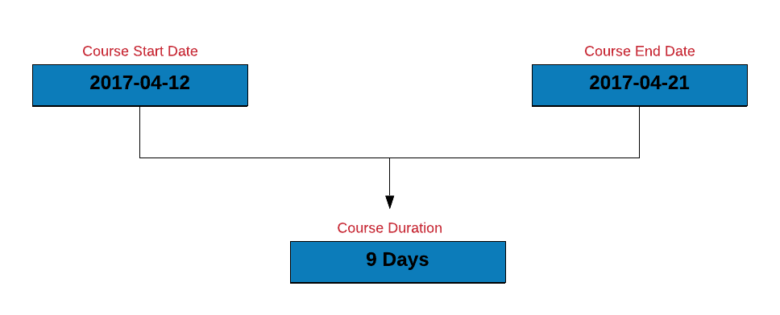
```

<br>

```{r lub19, collapse = TRUE}
course_start    <- as_date('2017-04-12')
course_end      <- as_date('2017-04-21')
course_duration <- course_end - course_start
course_duration
```

### Shift Date

Time to shift the course dates. We can shift a date by days, weeks or months. Let us shift the course start date by:

- 2 days
- 3 weeks
- 1 year

<br>

```{r img3lub, echo=FALSE, out.width="100%", fig.align="center"}
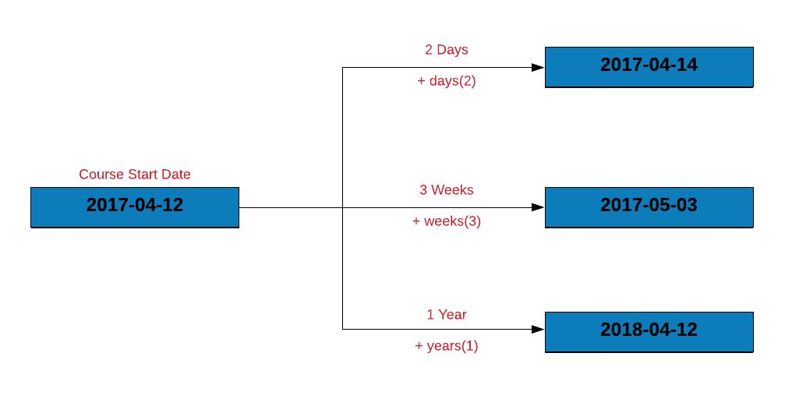
```

<br>

```{r lab40, collapse = TRUE}
course_start + days(2)
course_start + weeks(3)
course_start + years(1)
```

### Case Study

#### Compute days to settle invoice

Let us estimate the number of days to settle the invoice by subtracting the
date of invoice from the date of payment.

```{r lub3}
transact |>
  mutate(
    days_to_pay = Payment - Invoice
  )
```

#### Compute days over due

How many of the invoices were settled post the due date? We can find this by:

- subtracting the due date from the payment date
- counting the number of rows where delay < 0 

```{r lub4}
transact |>
  mutate(
    delay = Due - Payment
  ) |>
  filter(delay < 0) |>
  mutate(
    delay = delay * -1
  ) |> 
  count(delay)
```

### Your Turn

- compute the length of a vacation which begins on `2020-04-19` and ends on `2020-04-25`
- recompute the length of the vacation after shifting the vacation start and end date by `10` days and `2` weeks
- compute the days to settle invoice and days overdue from the `receivables.csv` data set
- compute the length of employment (only for those employees who have been terminated) from the `hr-data.csv` data set (use date of hire and termination)

## Time Zones 

### Introduction

```{r img_timezones, fig.align='center', out.width="200%", echo=FALSE}
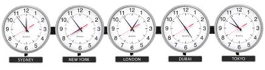
```

In the previous section, `POSIXlt` stored date/time components as a list. Among 
the different components it returned were

- `gmtoff`
- `zone`

`gmtoff` is offset in seconds from GMT i.e. difference in hours and minutes from 
UTC. Wait.. What do UTC and GMT stand for?

- Coordinated Universal Time (UTC)
- Greenwich Meridian Time (GMT)

Since we are talking about UTC, GMT etc., let us spend a little time on 
understanding the basics of time zones and daylight savings.

### Time Zones

Timezones exist because different parts of the Earth receive sun light at 
different times. If there was a single timezone, noon or morning would mean 
different things in different parts of the world. The timezones are based on 
Earth's rotation. The Earth moves ~15 degrees every 60 minutes i.e. 360 degrees 
in 24 hours. The planet is divided into 24 timezones each 15 degrees of 
longitude width. 

Now, you have heard of Greenwich Meridian Time (GMT) right? We just saw GMT off 
set in `POSIXlt` and you would have come across it in other time formats as 
well. For example, India timezone is given as GMT +5:30. Let us explore GMT in a 
little more detail. Greenwich is a suburb of London and the time at Greenwich 
is **G**reenwich **M**ean **T**ime. As you move West from Greenwich, every 15 
degree section is one hour earlier than GMT and every 15 degree section to the 
East is an hour later. 

Alright! What is **UTC** then? **C**oordinated **U**niversal **T**ime (UTC) , 
on the other hand, is the time standard commonly used across the world. Even 
though they share the same current time, **GMT** is a **timezone** while 
**UTC** is a **time standard**.

So how do we check the timezone in R? When you run `Sys.timezone()`, you should 
be able to see the timezone you are in. 

```{r sys_time_zones}
Sys.timezone()
```

If you do not see the timezone, use `Sys.getenv()` to get the value of the 
**TZ** environment variable.

```{r get_time_zone}
Sys.getenv("TZ")
```

If nothing is returned, it means we have to set the timezone. Use `Sys.setenv()` 
to set the timezone as shown below. The author resides in India and hence the 
timezone is set to `Asia/Calcutta`. You need to set the timezone in which you 
reside or work.

```{r set_time_zone}
Sys.setenv(TZ = "Asia/Calcutta")
```

Another way to get the timezone is through `tz()` from the lubridate package.

```{r tz_release_date}
lubridate::tz(Sys.time())
```

If you want to view the time in a different timezone, use `with_tz()`. Let us 
look at the current time in **UTC** instead of **Indian Standard Time**.

```{r with_tz}
lubridate::with_tz(Sys.time(), "UTC")
```

### Daylight Savings

```{r img_daylight, fig.align='center', out.width="200%", echo=FALSE}
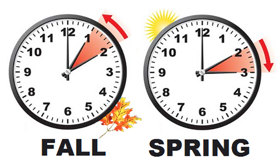
```

Daylight savings also known as 

- daylight saving time
- daylight savings time
- daylight time
- summer time

is the practice of advancing clocks during summer months so that darkness falls 
later each day according to the clock. In other words

- advance clock by one hour in spring (spring forward)
- retard clocks by one hour in autumn (fall back)

In R, the `dst()` function is an indicator for daylight savings. It returns 
`TRUE` if daylight saving is in force, `FALSE` if not and `NA` if unknown.

```{r dst}
dst(Sys.Date()) 
```

### Your Turn

- check the timezone you live in
- check if daylight savings in on
- check the current time in **UTC** or a different time zone 

## Intervals, Duration & Period 

In this chapter, we will learn about 

- intervals
- duration
- and period

### Interval

An interval is a timespan defined by two date-times. Let us represent the length
of the course using `interval`. 

<br>

```{r img_course_interval, echo=FALSE, out.width="100%", fig.align="center"}
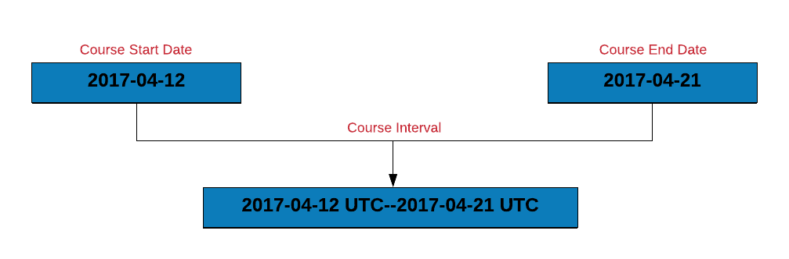
```

<br>

```{r lub10}
course_start    <- as_date('2017-04-12')
course_end      <- as_date('2017-04-21')
interval(course_start, course_end)
```

If you observe carefully, the interval is represented by the course start and
end dates. We will learn how to use intervals in the case study.

#### Overlapping Intervals

Let us say you are planning a vacation and want to check if the vacation
dates overlap with the course dates. You can do this by:

- creating vacation and course intervals
- use `int_overlaps()` to check if two intervals overlap. It returns `TRUE`
if the intervals overlap else `FALSE`.

Let us use the vacation start and end dates to create `vacation_interval`
and then check if it overlaps with `course_interval`. 

<br>

```{r img_intervals_overlap, echo=FALSE, out.width="100%", fig.align="center"}
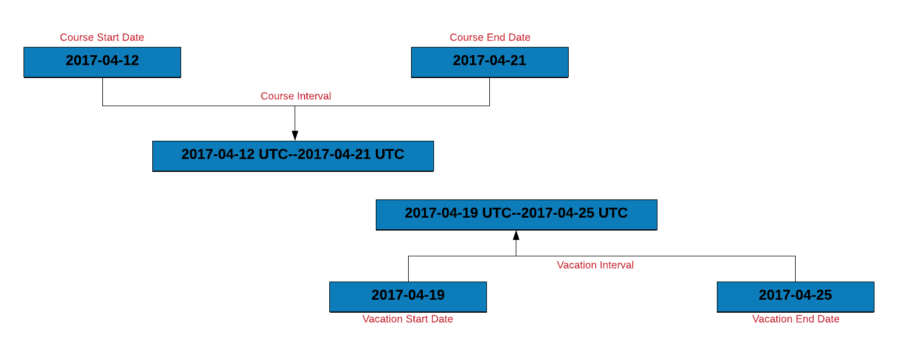
```

<br>

```{r lub60, collapse = TRUE}
vacation_start    <- as_date('2017-04-19')
vacation_end      <- as_date('2017-04-25')
course_interval   <- interval(course_start, course_end)
vacation_interval <- interval(vacation_start, vacation_end)
int_overlaps(course_interval, vacation_interval)
```

#### How many invoices were settled within due date?

Let us use intervals to count the number of invoices that were settled within
the due date. To do this, we will:

- create an interval for the invoice and due date
- create a new column `due_next` by incrementing the due date by 1 day
- another interval for `due_next` and the payment date
- if the intervals overlap, the payment was made within the due date 

```{r lub7}
transact |>
  mutate(
    inv_due_interval = interval(Invoice, Due),
    due_next         = Due + days(1),
    due_pay_interval = interval(due_next, Payment),
    overlaps         = int_overlaps(inv_due_interval, due_pay_interval)
  ) |>
  select(Invoice, Due, Payment, overlaps)
```

Below we show another method to count the number of invoices paid within the
due date. Instead of using `days` to change the due date, we use `int_shift`
to shift it by 1 day.

```{r lub12}
transact |>
  mutate(
    inv_due_interval = interval(Invoice, Due),
    due_pay_interval = interval(Due, Payment),  
    due_pay_next     = int_shift(due_pay_interval, by = days(1)),
    overlaps         = int_overlaps(inv_due_interval, due_pay_next)
  ) |>
  select(Invoice, Due, Payment, overlaps)
```

You might be thinking why we incremented the due date by a day before creating
the interval between the due day and the payment day. If we do not increment, 
both the intervals will share a common date i.e. the due date and they will
always overlap as shown below:

```{r lub7a}
transact |>
  mutate(
    inv_due_interval = interval(Invoice, Due),
    due_pay_interval = interval(Due, Payment),
    overlaps         = int_overlaps(inv_due_interval, due_pay_interval)
  ) |>
  select(Invoice, Due, Payment, overlaps)
```

#### Shift Interval

Intervals can be shifted too. In the below example, we shift the course 
interval by:

- 1 day
- 3 weeks
- 1 year 

<br>

```{r img_shift_interval, echo=FALSE, out.width="100%", fig.align="center"}
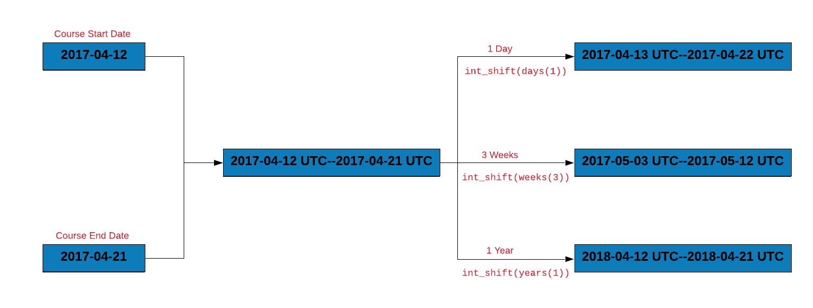
```

<br>

```{r lab50, collapse = TRUE}
course_interval <- interval(course_start, course_end)

# shift course_interval by 1 day 
int_shift(course_interval, by = days(1))

# shift course_interval by 3 weeks
int_shift(course_interval, by = weeks(3))

# shift course_interval by 1 year
int_shift(course_interval, by = years(1))
```

### Within

Let us assume that we have to attend a conference in April 2017. Does it occur
during the course duration? We can answer this using `%within%` which will
return `TRUE` if a date falls within an interval.

<br>

```{r img_within, echo=FALSE, out.width="100%", fig.align="center"}
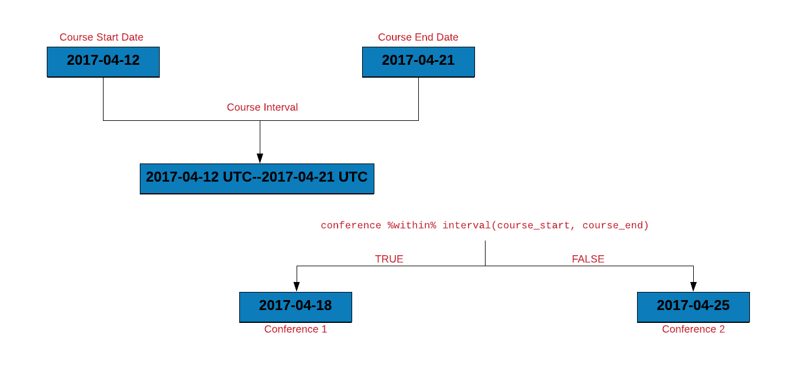
```

<br>

```{r lub30, collapse = TRUE}
conference <- as_date('2017-04-15')
conference %within% course_interval
```

#### How many invoices were settled within due date?

Let us use `%within%` to count the number of invoices that were settled within 
the due date. We will do this by:

- creating an interval for the invoice and due date
- check if the payment date falls within the above interval

```{r lub13}
transact |>
  mutate(
    inv_due_interval = interval(Invoice, Due),
    overlaps         = Payment %within% inv_due_interval
  ) |>
  select(Due, Payment, overlaps)
```

### Duration

Duration is timespan measured in seconds. To create a duration object, use
`duration()`. The timespan can be anything from seconds to years but it will be
represented as seconds. Let us begin by creating a duration object where the timespan is in seconds.

```{r duration_1}
duration(50, "seconds")
```

Another way to specify the above timespan is shown below:

```{r duration_2}
duration(second = 50)
```

As you can see, the output is same in both the cases. Let us increase the timespan to 60 seconds and see what happens.

```{r duration_3}
duration(second = 60)
```

Although the timespan is primarily measured in seconds, it also shows `~1 minutes` in the brackets. As the length of the timespan increases i.e. the number becomes large, it is represented using larger units such as hours and days. In the below examples, as the number of seconds increases, you can observe larger units being used to represent the timespan.


```{r duration_4}
# minutes
duration(minute = 50)
duration(minute = 60)

# hours
duration(hour = 23)
duration(hour = 24)
```

The following helper functions can be used to create duration objects as well.

```{r duration_5}
# default
dseconds()
dminutes()

# seconds
duration(second = 59)
dseconds(59)

# minutes
duration(minute = 50)
dminutes(50)

# hours
duration(hour = 36)
dhours(36)

# weeks
duration(week = 56)
dweeks(56)
```

Let us use the above helper functions to get the course length in different units.

```{r img_convert, echo=FALSE, out.width="100%", fig.align="center"}
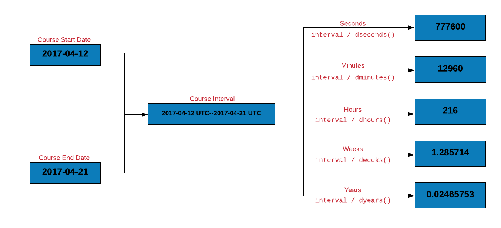
```

<br>

```{r lub11, collapse = TRUE}
# course length in seconds 
course_interval / dseconds()

# course length in minutes
course_interval / dminutes()

# course length in hours
course_interval / dhours()

# course length in weeks
course_interval / dweeks()

# course length in years
course_interval / dyears()
```

### Period

A `period` is a timespan defined in units such as years, months, and days. In
the below examples, we use `period()` to represent timespan using different
units.

```{r period_examples}
# second
period(5, "second")
period(second = 5)

# minute & second
period(c(3, 5), c("minute", "second"))
period(minute = 3, second = 5)

# hour, minte & second
period(c(1, 3, 5), c("hour", "minute", "second"))
period(hour = 1, minute = 3, second = 5)

# day, hour, minute & second
period(c(3, 1, 3, 5), c("day", "hour", "minute", "second"))
period(day = 3, hour = 1, minute = 3, second = 5)
```

<br>

```{r img_as_period, echo=FALSE, out.width="100%", fig.align="center"}
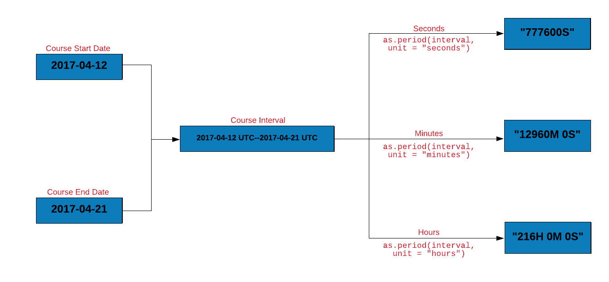
```

<br>

Let us get the course length in different units using `as.period()`.

```{r lub17, collapse = TRUE}
# course length in second
as.period(course_interval, unit = "seconds")

# course length in hours and minutes
as.period(course_interval, unit = "minutes")

# course length in hours, minutes and seconds
as.period(course_interval, unit = "hours")
```


`time_length()` computes the exact length of a timespan i.e. `duration`, `interval` or `period`. Let us use `time_length()` to compute the length of the
course in different units.

<br>

```{r img_time_length, echo=FALSE, out.width="100%", fig.align="center"}
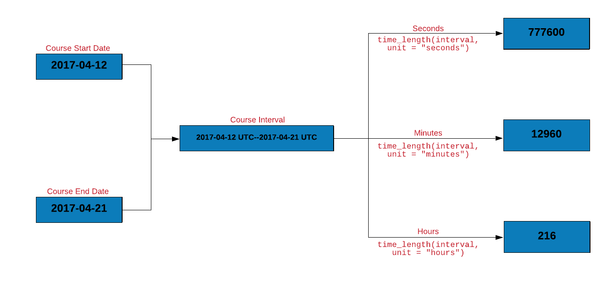
```

<br>

```{r lub16, collapse = TRUE}
# course length in seconds
time_length(course_interval, unit = "seconds")

# course length in minutes
time_length(course_interval, unit = "minutes")

# course length in hours
time_length(course_interval, unit = "hours")
```

### lubridate interval vs duration vs period

The three timespans answer different questions:

| Timespan | Answers | Clock behavior |
|---|---|---|
| `interval` (`%--%`) | When did it start and end? | Anchored to two endpoints |
| `duration` (`ddays()`, `dyears()`) | How many exact seconds? | Fixed 86,400 s/day, DST-blind |
| `period` (`days()`, `years()`) | How does the clock read? | Calendar-aware, follows DST |

The difference bites across daylight-saving boundaries. US clocks sprang
forward on 2020-03-08, so that Sunday lasted 23 hours:

```{r lub_interval_vs_duration}
t <- ymd_hms("2020-03-07 12:00:00", tz = "America/New_York")

# period: same wall-clock time next day (noon stays noon)
t + days(1)

# duration: exactly 86,400 seconds later (lands at 1pm)
t + ddays(1)
```

Rule of thumb: scheduling and human arithmetic (invoice due in 30 days,
`days_to_pay` in `transact`) → `period`; elapsed-time measurement and
benchmarks → `duration`; anchoring and testing overlap (`%within%`,
`int_overlaps()`) → `interval`.

## Others 

In this section, we will learn to round date/time to the nearest unit and roll 
back dates. 

### Rounding Dates

We will explore functions for rounding dates

- to the nearest value using `round_dates()`
- down using `floor_date()`
- up using `ceiling_date()`

The unit for rounding can be any of the following:

- second
- minute
- hour
- day
- week
- month
- bimonth
- quarter
- season
- halfyear
- and year

We will look at a few examples using `round_date()` and you will then practice 
using the other two functions.

```{r round_dates}
# minute
round_date(release_date, unit = "minute")
round_date(release_date, unit = "mins")
round_date(release_date, unit = "5 mins")

# hour
round_date(release_date, unit = "hour")

# day
round_date(release_date, unit = "day")
```

### Rollback 

Use `rollback()` if you want to change the date to the last day of the previous 
month or the first day of the month.

```{r rollback_1}
rollback(release_date)
```

To change the date to the first day of the month, use the `roll_to_first` 
argument and set it to `TRUE`.

```{r rollback_2}
rollback(release_date, roll_to_first = TRUE)
```

### Your Turn

- round up the `transact` due dates to weeks
- round down the `transact` due dates to days
- rollback the `transact` due dates to the beginning of the month

## Try it live {.unnumbered}

:::{.callout-tip}
## Try it in your browser

Edit the code below and press **Run**. It executes entirely in your browser
via [WebR](https://docs.r-wasm.org/webr/latest/) — no R installation needed.
The runtime downloads once, on this page only.
:::

```{webr-r}
library(dplyr)
library(lubridate)
library(readr)
if (!file.exists("transact_sample.csv")) {
  download.file(
    "https://wrangle-r.rsquaredacademy.com/data-webr/transact_sample.csv",
    "transact_sample.csv"
  )
}
transact <- read_csv("transact_sample.csv", show_col_types = FALSE)
transact |>
  mutate(days_to_pay = Payment - Invoice) |>
  select(Invoice, Due, Payment, days_to_pay) |>
  head()
```
