# Factor Manipulation with forcats {#forcats-manipulation}

This chapter continues @categorical-data-in-r. We reorder, relevel,
recode, collapse and lump factors with **forcats**, and visualize them
with **ggplot2** only.

```{r fct_setup_b, echo=FALSE, message=FALSE, warning=FALSE}
library(knitr)
library(kableExtra)
library(forcats)
library(readr)
library(dplyr)
library(ggplot2)
library(ggpubr)
library(plotrix)
data <- readRDS('analytics.rds')
```

## Data Manipulation {#manipulate}

### Introduction

In this section, our focus will be on handling the levels of a categorical variable, and exploring the [forcats](https://forcats.tidyverse.org/) package for the same. We will basically look at 3 key operations or transformations we would like to do when it comes to factors which are:

- change value of levels
- add or remove levels
- change order of levels

Before we start working with the value of the levels, let us take a quick look at some of the functions we used in the previous sections. We will store the source of traffic as `channel` instead of referring to the column in the `data.frame` every time.

```{r channel}
channel <- data$channel
```

Let us go back to the function we used for tabulating data, `fct_count()`. If you observe the result, it is in the same order as displayed by `levels()`.

```{r fct_helpers}
fct_count(channel)
```

If you want to sort the results by the count i.e. most common level comes at the top, use the `sort` argument.

```{r fct_sort, echo=FALSE, fig.align="center"}
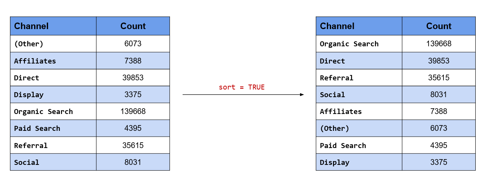
```

```{r fct_helpers_2}
fct_count(channel, sort = TRUE)
```

If you want to view the proportion along with the count, set the `prop` argument to `TRUE`.

```{r fct_count_prop}
fct_count(channel, prop = TRUE)
```

One of the important steps in data preparation/sanitization is to check if the levels are valid i.e. only levels which should be present in the data are actually present. `fct_match()` can be used to check validity of levels. It returns a logical vector if the level is present and an error if not.

```{r fct_match}
channel |>
  fct_match("Social") |>
  table()
```

### Your Turn...

1. Display the count/frequency of the following variables in the descending order

    - `device`
    - `landing_page`
    - `exit_page`

2. Check if `laptop` is a level in the `device` column.

### Change Value of Levels

In this section, we will learn how to change the value of the levels. In order to keep it interesting, we will state an objective from our case study and then map it into a function from the [forcats](https://forcats.tidyverse.org/) package.

**Combine both Paid & Organic Search into a single level, Search**

```{r fct_collapse_img, echo=FALSE, fig.align="center"}
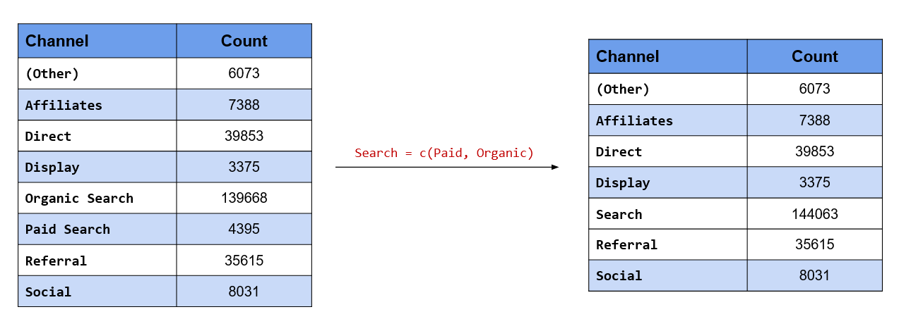
```

In this case, we want to change the value of two levels, *Paid Search* & *Organic Search* and give them the common value *Search*. You can also look at it as collapsing two levels into one. There are two functions we can use here:

- `fct_collapse()`
- `fct_recode()`

Let us look at `fct_collapse()` first. After specifying the categorical variable, we specify the new value followed by a character vector of the existing values. Remember, the new value is not enclosed in quotes (single or double) but the existing values must be a `character` vector.

```{r fct_collapse}
channel |> 
  fct_collapse(Search = c("Paid Search", "Organic Search")) |> 
  fct_count()
```

In the case of `fct_recode()`, each value being changed must be specified in a new line. Similar to
`fct_collapse()`, the new value is not enclosed in quotes but the existing values must be.

```{r fct_recode_img, echo=FALSE, fig.align="center"}
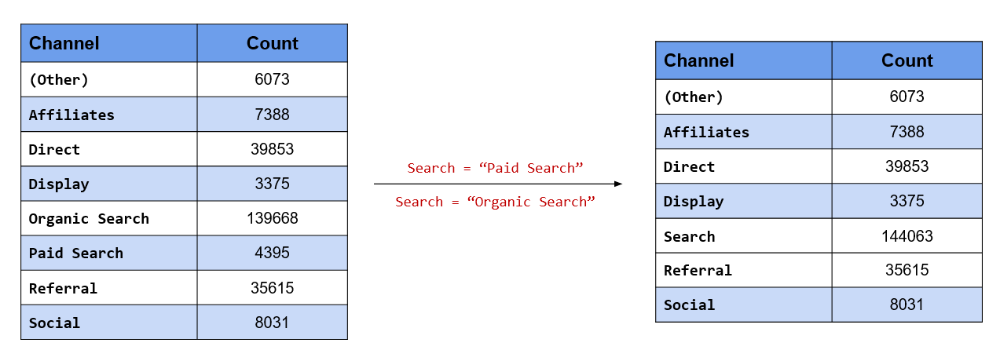
```

```{r fct_recode}
channel |> 
  fct_recode(
    Search = "Paid Search",
    Search = "Organic Search"
  ) |> 
  fct_count()
```

The [dplyr](https://dplyr.tidyverse.org/) and [car](https://cran.r-project.org/package=car) packages also have recode functions.

**Retain only those channels which have driven a minimum traffic of 5000 to the website**

```{r fct_lump_1_img, echo=FALSE, fig.align="center"}
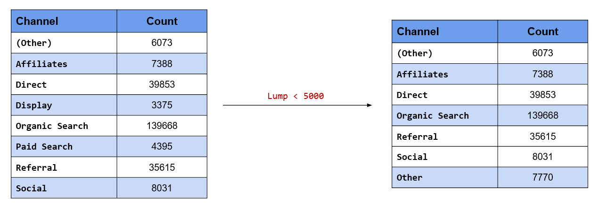
```

Instead of having all the channels, we desire to retain only those channels which have driven at least *5000* visits to the website. What about the rest of the channels which have driven less than *5000*? We will recategorize them as **Other**. Keep in mind that we already have a **(Other)** level in our data. `fct_lump_min()` will lump together all levels which do not have a minimum count specified. In our case study, only **Display** drives less than *5000* visits and it will be categorized into **Other**.

```{r fct_lump_1}
channel |> 
  fct_lump_min(min = 5000) |> 
  fct_count()
```

**Retain only top 3 referring channels and categorize rest into Other**

```{r fct_lump_2_img, echo=FALSE, fig.align="center"}
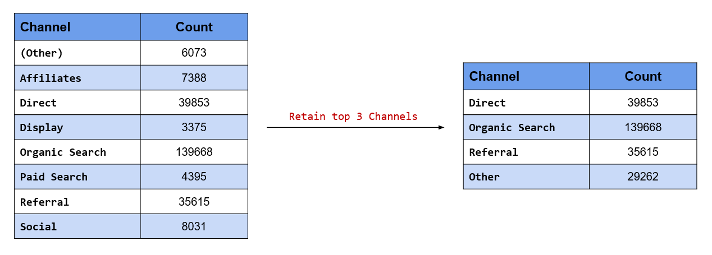
```

Suppose you decide to retain only the top 3 channels in terms of the traffic driven to the website. In our
case study, these are **Direct**, **Organic Search** and **Referral**. We want to retain these 3 levels and categorize the rest as **Other**. `fct_lump_n()` will retain top `n` levels by count/frequency and lump the rest into **Other**.

```{r fct_lump_2}
channel |> 
  fct_lump_n(n = 3) |> 
  fct_count()
```

In our case, `n` is 3 and hence the top 3 channels in terms of traffic driven are retained while the rest are
lumped into **Other**.

**Retain only those channels which have driven at least 2% of the overall traffic**

```{r fct_lump_3_img, echo=FALSE, fig.align="center"}
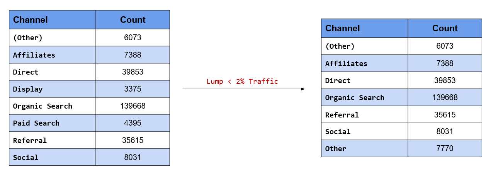
```

In the second scenario above, we retained channels based on minimum traffic driven by them to the website.
The criteria was count of visits. If you want to specify the criteria as a percentage or proportion instead of count, use `fct_lump_prop()`. The criteria is a value between **0** and **1**. In our case study, we want to retain channels that have driven at least **2%** of the overall traffic. Hence, we have specified the criteria as `0.02`.

```{r fct_lump_3}
channel |> 
  fct_lump_prop(prop = 0.02) |> 
  fct_count()
```

As you can see, only **Display** drives less than **2%** of overall traffic and has been lumped into **Other**.

**Retain the following channels and merge the rest into Other**

- Organic Search
- Direct
- Referral

In the previous scenarios, we have been retaining or lumping channels based on some criteria like count or
percentage of traffic driven to the website. In this scenario, we want to retain certain levels by specifying
their labels and combine the rest into **Other**. While we can use `fct_collapse()` or `fct_recode()`, a more
appropriate function would be `fct_other()`. We will do a comparison of the three functions in a short while.

```{r fct_other_img, echo=FALSE, fig.align="center"}
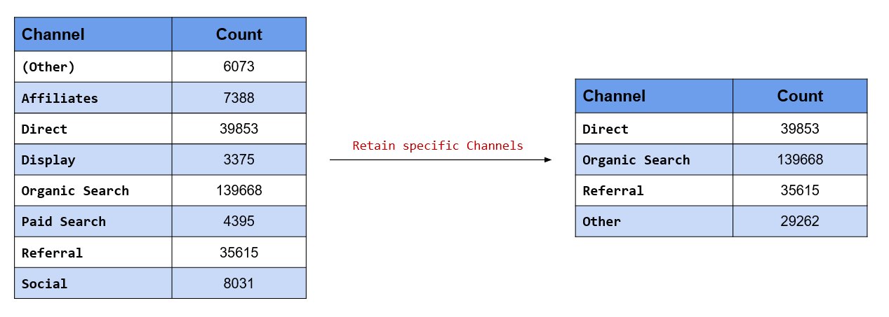
```

`fct_other()` has two arguments, `keep` and `drop`. `keep` is used when we know the levels we want to retain
and `drop` is used when we know the levels we want to drop. In this scenario, we know the levels we want to
retain and hence we will use the `keep` argument and specify them. **Organic Search**, **Direct** and **Referral** will be retained while the rest of the channels will be lumped into **Other**.

```{r fct_other_keep}
# channels to be retained 
retain <- c("Organic Search", "Direct", "Referral")

channel |> 
  fct_other(keep = retain) |> #<<
  fct_count()
```

**Merge the following channels into Other and retain rest of them:**

- Display
- Paid Search

```{r fct_others_drop_img, echo=FALSE, fig.align="center"}
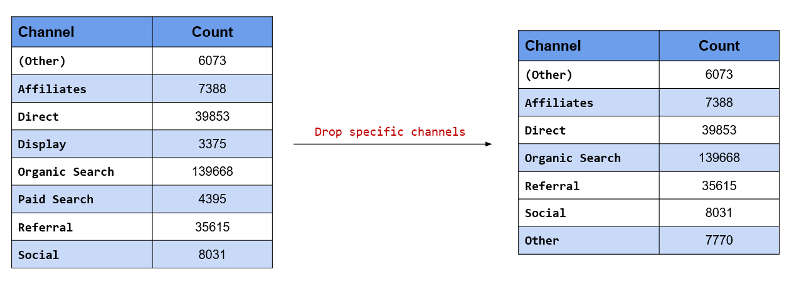
```

In this scenario, we know the levels we want to drop and hence we will use the `drop` argument and specify
them. **Display** and **Paid Search** will be lumped into **Other** while the rest of the channels will be retained.

```{r fct_other_drop}
# channels to be dropped
dropped <- c("Display", "Paid Search")

channel |> 
  fct_other(drop = dropped) |> 
  fct_count()
```

In the previous scenario, we said we will compare `fct_other()` with `fct_collapse()` and `fct_recode()`. Let us use the other two functions as well and see the difference. 

```{r fct_other_compare}
# collapse
channel |> 
  fct_collapse(Other = c("(Other)",     
                         "Affiliates",  
                         "Display",      
                         "Paid Search", 
                         "Social")) |> 
  fct_count()

# recode
channel |> 
  fct_recode(Other = "(Other)",     
             Other = "Affiliates",  
             Other = "Display",     
             Other = "Paid Search", 
             Other = "Social") |>  
  fct_count()
```

As you can observe, `fct_other()` requires less typing and is easier to specify.

**Anonymize the data set before sharing it with your colleagues**

```{r fct_anonymize_img, echo=FALSE, fig.align="center"}
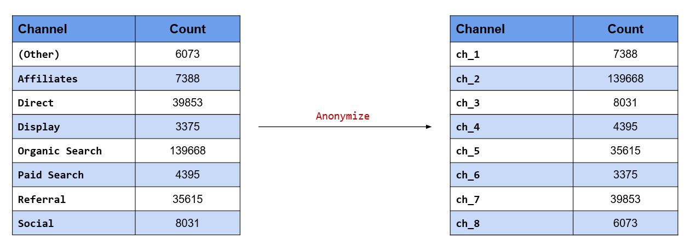
```

Anonymizing data is extremely important when you are sharing sensitive data with others. Here, we want
to anonymize the channels which drive traffic to the website so that we can share it with others without
divulging the names of the channels. `fct_anon()` allows us to anonymize the levels in the data. Using the
`prefix` argument, we can specify the prefix to be used while anonymizing the data.

```{r fct_anon}
channel |> 
  fct_anon(prefix = "ch_") |> 
  fct_count()
```

### Key Functions

```{r key_functions_1, echo=FALSE}
fname   <- c("`fct_collapse()`", "`fct_recode()`", "`fct_lump_min()`",
             "`fct_lump_n()`", "`fct_lump_prop()`", "`fct_lump_lowfreq()`",
             "`fct_other()`", "`fct_anon()`")
descrip <- c("Collapse factor levels", "Recode factor levels", 
             "Lump factor levels with count lesser than specified value", 
             "Lump all levels except the top n levels",
             "Lump factor levels with count lesser than specified proportion", 
             "Lump together least frequent levels",
             "Replace levels with Other level",
             "Anonymize factor levels")
data.frame(Function = fname, Description = descrip) |> 
  kable() |> 
  kable_styling(
    bootstrap_options = c("striped", "hover", "condensed", "responsive")
  )
```

### Your Turn..

3. Combine the following levels in `landing_page` into `Account`

    - `My Account`
    - `Register`
    - `Sign In`
    - `Your Info`

4. Combine levels in `landing_page` that drive less than 1000 visits.

5. Get top 10 landing and exit pages.

6. Get landing pages that drive at least 5% of the total traffic to the website.

7. Retain only the following levels in the `browser` column:

    - `Chrome`
    - `Firefox`
    - `Safari`
    - `Edge`
    
8. Anonymize landing and exit page levels.

### Add / Remove Levels

In this small section, we will learn to:

- add new levels
- drop levels
- make missing values explicit

**Add a new level, Blog**

```{r fct_expand_img, echo=FALSE, fig.align="center"}
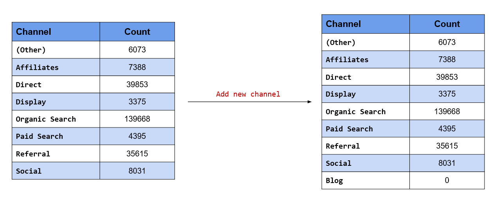
```

`fct_expand()` allows us to add new levels to the data. The label of the new level must be specified after the variable name and must be enclosed in quotes. If the level already exists, it will be ignored. Let us add a new level, `Blog`.

```{r fct_expand}
channel |> 
  fct_expand("Blog") |> #<<
  levels()
```

**Drop existing level**

```{r fct_drop_img, echo=FALSE, fig.align="center"}
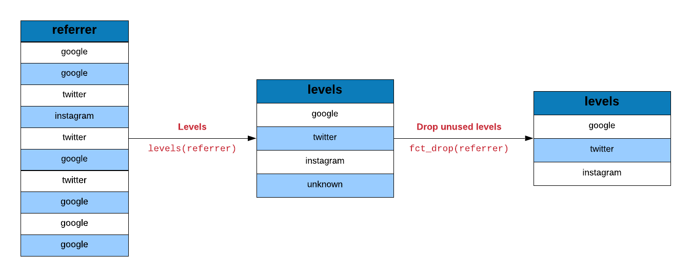
```

On the other hand, `fct_drop()` will drop levels which have no values i.e. unused levels. If you want
to drop only specific levels, use the `only` argument and specify the name of the level in quotes. Let us drop the new level we added in the previous example.

```{r fct_drop}
channel |> 
  fct_expand("Blog") |> 
  fct_drop() |> #<<
  levels()
```

**Make missing values explicit**

```{r fct_na_img, echo=FALSE, fig.align="center"}
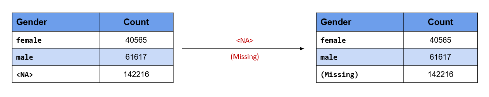
```

In our data set, the gender column has many missing values, and in R, missing values are represented by `NA`. Suppose you are sharing the data or analysis with someone who is not an R user, and does not know what `NA` represents. In such a scenario, we can use the `fct_na_value_to_level()` function to make the missing values in the gender column explicit i.e. it will appear as `(Missing)` instead of `NA`. This will help non R users to understand that there are missing values in the data.

```{r fct_na_value_to_level}
data |> 
  pull(gender) |> 
  fct_na_value_to_level(level = "(Missing)") |>  #<<
  fct_count()
```

### Key Functions

```{r key_functions_2, echo=FALSE}
fname   <- c("`fct_expand()`", "`fct_drop()`", "`fct_na_value_to_level()`")
descrip <- c("Add additional levels to a factor", 
             "Drop unused factor levels", 
             "Make missing values explicit")
data.frame(Function = fname, Description = descrip) |> 
  kable() |> 
  kable_styling(
    bootstrap_options = c("striped", "hover", "condensed", "responsive")
  )
```

### Change Order of Levels

In this last part of this section, we will learn how to change the order of the levels. We will look at the following scenarios from our case study:

We want to make

- Organic Search the first level
- Referral the third level
- Display the last level

**Organic Search is the first level**

```{r fct_relevel_img, echo=FALSE, fig.align="center"}
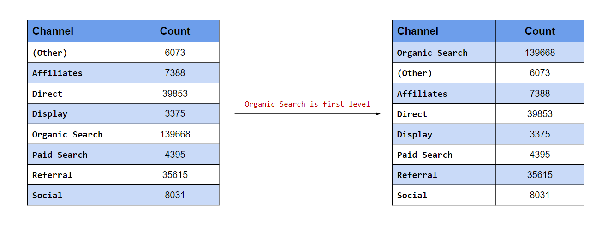
```

In this scenario, we want the levels to appear in a certain order. In the first case, we want **Organic Search** to be the first level. `fct_relevel()` allows us to manually reorder the levels. To move a level to the beginning, specify the label (it must be enclosed in quotes).

```{r fct_relevel_1}
levels(channel)

channel |> 
  fct_relevel("Organic Search") |> #<<
  levels()
```

**Referral is the third level**

```{r fct_relevel_2_img, echo=FALSE, fig.align="center"}
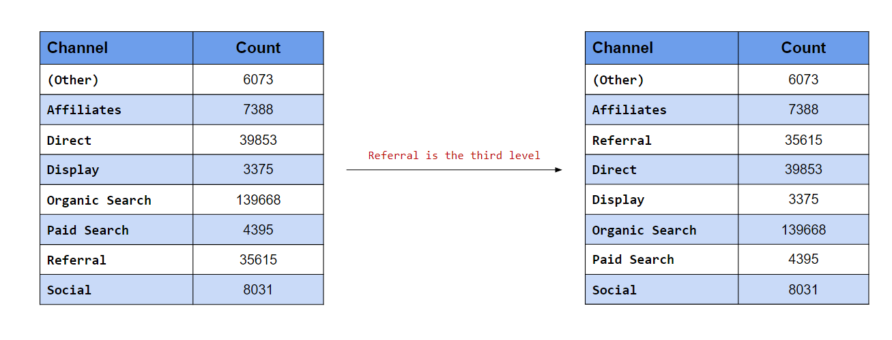
```

The `after` argument is useful when we want to move the level to the end or anywhere between the beginning and end. In the second case, we want **Referral** to be the third level. After specifying the label, use the `after` argument and specify the level after which **Referral** should appear. Since we want to move it to the third position, we will set the value of `after` to `2` i.e. **Referral** should come after the second position.

```{r fct_relevel_2}
levels(channel)

channel |> 
  fct_relevel("Referral", after = 2) |> #<<
  levels()
```

**Display is the last level**

```{r fct_relevel_3_img, echo=FALSE, fig.align="center"}
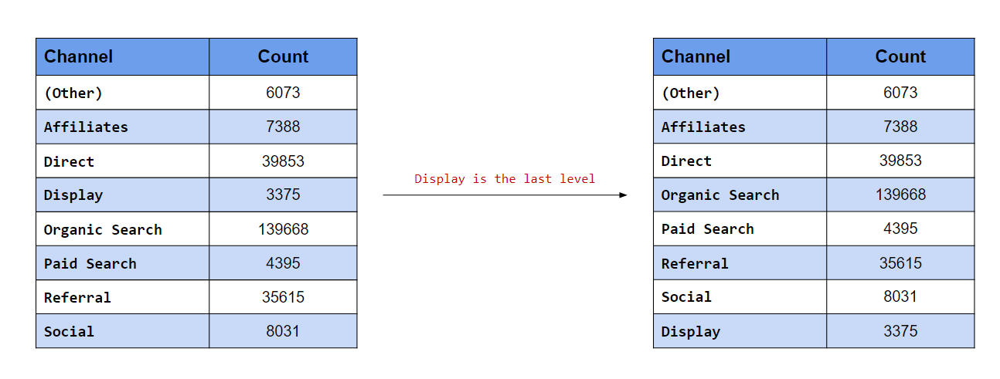
```

In this last case, we want to move **Display** to the end. If you know the number of levels, you can specify a value here. In our data, there are eight channels i.e. eight levels, so we can set the value of `after` to `7`. What happens when we do not know the number of levels or if they tend to vary? In such cases, to move a level to the end, set the value of `after` to `Inf`.

```{r fct_relevel_3}
levels(channel)

channel |> 
  fct_relevel("Display", after = Inf) |> #<<
  levels()
```

Let us now look at a scenario where we want to order the levels by

-  frequency (largest to smallest)
-  order of appearance (in data)

**Order levels by frequency**

```{r fct_infreq_img, echo=FALSE, fig.align="center"}
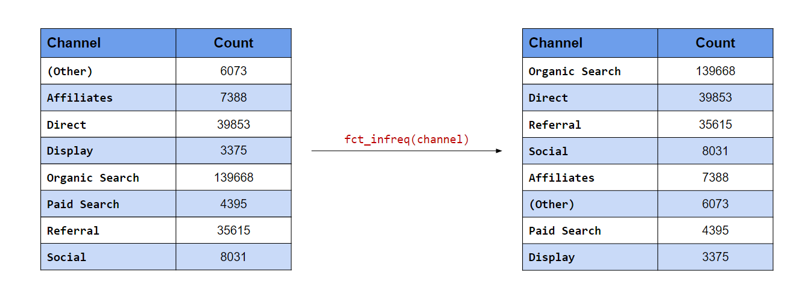
```

In the first case, the levels with the most frequency should appear at the top. `fct_infreq()` will order the
levels by their frequency.

```{r fct_infreq}
levels(channel)

# order levels by frequency
channel |> 
  fct_infreq() |> #<<
  levels()
```

**Order levels by appearance**

```{r fct_inorder_img, echo=FALSE, fig.align="center"}
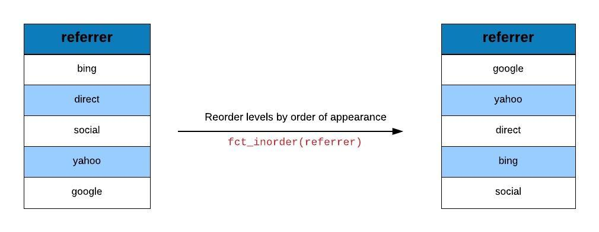
```

In the second case, the order of the levels should be the same as the order of their appearance in the data. `fct_inorder()` will order the levels according to the order in which they appear in the data.

```{r fct_inorder}
levels(channel)

# order levels in order of appearance
channel |> 
  fct_inorder() |> #<<
  levels()
```

**Reverse the order of the levels**

```{r fct_rev_img, echo=FALSE, fig.align="center"}
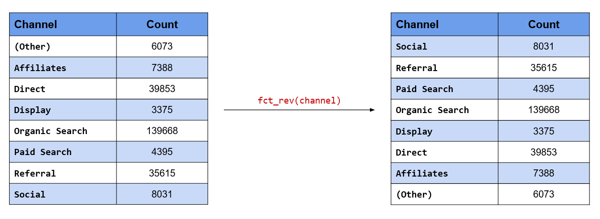
```

The order of the levels can be reversed using `fct_rev()`.

```{r fct_rev}
levels(channel)

# reverse order of levels
channel |> 
  fct_rev() |> #<<
  levels()
```

**Randomly shuffle the order of the levels**

```{r fct_shuffle_img, echo=FALSE, fig.align="center"}
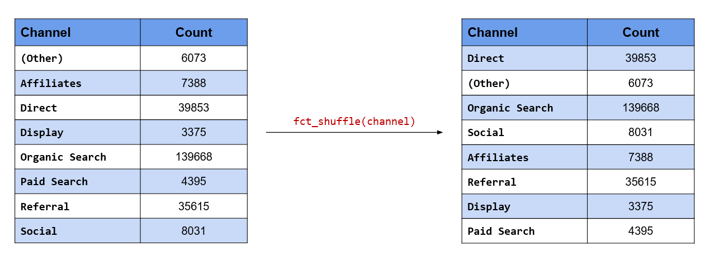
```

The order of the levels can be randomly shuffled using `fct_shuffle()`.

```{r fct_shuffle}
levels(channel)

# randomly shuffle order of levels
channel |> 
  fct_shuffle() |> #<<
  levels()
```

### Key Functions

```{r key_functions_3, echo=FALSE}
fname   <- c("`fct_relevel()`", "`fct_shift()`", "`fct_infreq()`",
             "`fct_rev()`", "`fct_inorder()`", "`fct_shuffle()`")
descrip <- c("Reorder factor levels", 
             "Shift factor levels", 
             "Reorder factor levels by frequency",
             "Reverse order of factor levels", 
             "Reorder factor levels by first appearance",
             "Randomly shuffle factor levels")
data.frame(Function = fname, Description = descrip) |> 
  kable() |> 
  kable_styling(
    bootstrap_options = c("striped", "hover", "condensed", "responsive")
  )
```

### Your Turn...

9. Make `Home` first level in the `landing_page` column.
 
10. Make `Apparel` second level in the `landing_page` column. 

11. Make `Specials` last level in the `landing_page` column. 

12. Order the levels in the browser by frequency:
    
13. Order the levels in landing page by appearance:
    
14. Shuffle the levels in os

15. Reverse the levels in browser

## Data Visualization {#dataviz}

### Introduction

In this section, we will learn to visualize categorical data. We will look at the following type of plots:

- univariate bar plot
- bivariate bar plot
    - grouped
    - stacked
    - proportional
- mosaic plot
- pie chart
- donut chart

We will be using [ggplot2](https://ggplot2.tidyverse.org) in this chapter. So you should know the basics of data visualization with ggplot2. If you are new or have never used ggplot2, do not worry. We have several [tutorials](https://blog.rsquaredacademy.com/data-visualization/index.html) and an [ebook](https://viz-ggplot2.rsquaredacademy.com/) on ggplot2, you can go through them first and then come back to this section.

### Bar Plot

Bar charts provide a visual representation of categorical data. The bars can be plotted either vertically or horizontally. The categories/groups appear along the horizontal X axis and the height of the bar represents a measured value.

```{r bar_plot}
ggplot(data) +
  geom_bar(aes(x = device), fill = "blue") +
  xlab("Device") + ylab("Count")
```

In the above example, the bars represent the count/frequency of the categories. If the bars represent continuous data, the value could be *mean* or *sum* of the variable being represented.

### Grouped Bar Plot

A grouped bar chart plots values for two levels of a categorical variable instead of one. You should use grouped bar chart when making comparisons across different categories of data. Use it when you want to look at how the second category variable changes within each level of the first and vice versa.

```{r grouped_bar_plot}
ggplot(data) +
  geom_bar(aes(x = device, fill = gender), position = "dodge") +
  xlab("Device") + ylab("Count")
```

### Stacked Bar Plot

In stacked bar plots, the bars are stacked on top of each other instead of placing them next to each other. Use stacked bar plots while looking at cumulative value.

```{r stacked_bar_plot}
ggplot(data) +
  geom_bar(aes(x = device, fill = gender)) +
  xlab("Device") + ylab("Count")
```

### Proportional Bar Plot

Also known as percent stacked plot, the height of all bars in this plot are the same. The distribution of the second categorical variable is scaled to 1 or 100. The length of each bar is determined by its share in the category. Use this when you want to concurrently observe each of several variables as they fluctuate and as their percentage ratio's change.

```{r prop_bar_plot}
data |> 
  select(device, gender) |> 
  table() |> 
  tibble::as_tibble() |> 
  ggplot(aes(x = device, y = n, fill = gender)) +
  geom_bar(stat = "identity", position = "fill") +
  xlab("Device") + ylab("Gender")
```

### Mosaic Plot

A mosaic plot is a graphical representation of a two way table or contingency table. It was introduced by Hartigan & Kleiner and is divided into rectangles. Proportions on horizontal axis represents the number of observations for each level of the X variable. The vertical length of each rectangle is proportional to the proportion of Y variable in each level of X variable.

Mosaic plots need the **ggmosaic** package (archived on CRAN) and are out of
scope here — they are covered in the [ggplot2 ebook](https://viz-ggplot2.rsquaredacademy.com/).

### Pie Chart

Pie chart is a circular chart, divided into slices to show relevant sizes of data. It shows the distribution of the different levels of a categorical variable as a circle is divided into radial slices. Each level corresponds with a single slice of the circle and size indicates the proportion of the level. Use it when comparing each group's contribution to the whole as opposed to comparing groups to each other.

**Base R**

```{r pie_chart}
data |> 
  pull(device) |> 
  table() |> 
  pie()
```

**3D Pie Chart**

```{r pie_chart_3d}
data |> 
  pull(device) |> 
  table() |> 
  pie3D(explode = 0.1)
```

**ggplot2**

```{r gg_pie_chart}
data |> 
  pull(device) |> 
  fct_count() |> 
  rename(device = f, count = n) |> 
  ggplot() +
  geom_bar(aes(x = "", y = count, fill = device), width = 1, stat = "identity") +
  coord_polar("y", start = 0)
```

### Donut Chart

Donut chart is a variation of the pie chart. It has a round hole in the middle which makes it look like a donut. The focus is on the length of the arcs and not the proportions of the slices. Blank spaces inside donut chart can be used to display information inside it. 

```{r gg_donut_chart}
data |> 
  pull(device) |> 
  fct_count() |> 
  rename(device = f, count = n) |> 
  ggdonutchart("count", label = "device", fill = "device", color = "white",
               palette = c("#00AFBB", "#E7B800", "#FC4E07"))
```


### Summary

- Bar charts provide a visual representation of categorical data.
- Use grouped bar chart to make comparison against different categories of data.
- Use stacked bar chart while looking at cumulative data.
- Use proportional bar chart when you want to concurrently observe each of the several variables as they fluctuate.
- Use mosaic plot to discover associations between two variables.
- Use pie chart and donut chart when comparing each group’s contribution to the whole.    
  

### Your Turn...

Generate all the below plots:

1. Bar plot of `channel` 

```{r plot_1, fig.align='center', fig.height=5, fig.width=7, echo=FALSE}
ggplot(data) +
  geom_bar(aes(x = channel), fill = "blue") +
    ggtitle("Source of Traffic") +
    xlab("Channel") + ylab("Count")
```

2. Display grouped bar plot of `user_type` by `channel`

```{r plot_2, fig.align='center', fig.height=5, fig.width=7, echo=FALSE}
ggplot(data) +
  geom_bar(aes(x = channel, fill = user_type), position = "dodge") +
    ggtitle("User Type by Channel") +
    xlab("Channel") + ylab("User Type")
```

3. Display stacked bar plot of `channel` by `gender`

```{r plot_3, fig.align='center', fig.height=5, fig.width=7, echo=FALSE}
ggplot(data) +
  geom_bar(aes(x = gender, fill = channel)) +
    ggtitle("Channel by Gender") +
    xlab("Gender") + ylab("Channel")
```

4. Display proportional bar plot of `channel` by `device`

```{r plot_4, fig.align='center', fig.height=5, fig.width=7, echo=FALSE}
data |> 
  select(device, channel) |> 
  table() |> 
  tibble::as_tibble() |> 
  ggplot(aes(x = device, y = n, fill = channel)) +
  geom_bar(stat = "identity", position = "fill") +
  ggtitle("Channel by Device") +
  xlab("Device") + ylab("Channel")
```
    
5. Display mosaic plot of `device` by `channel`

Mosaic plots need the **ggmosaic** package (archived on CRAN) and are out of
scope here — they are covered in the [ggplot2 ebook](https://viz-ggplot2.rsquaredacademy.com/).

6. Display pie or donut chart of `channel`

6.1 Pie Chart

```{r plot_6, fig.align='center', echo=FALSE}
data |> 
  pull(channel) |> 
  table() |> 
  pie()
```

6.2 3D Pie Chart

```{r plot_7, fig.align='center', echo=FALSE}
data |> 
  pull(channel) |> 
  table() |> 
  pie3D(explode = 0.1)
```

6.3 Pie Chart (ggplot2)

```{r plot_8, fig.align='center', echo=FALSE}
data |> 
  pull(channel) |> 
  fct_count() |> 
  rename(channel = f, count = n) |> 
  ggplot() +
  geom_bar(aes(x = "", y = count, fill = channel), 
           width = 1, stat = "identity") +
  coord_polar("y", start = 0)
```

6.4 Donut Chart

```{r plot_9, fig.align='center', fig.height=8, fig.width=10, echo=FALSE}
data |> 
  pull(channel) |> 
  fct_count() |> 
  rename(channel = f, count = n) |> 
  ggdonutchart("count", label = "channel", fill = "channel", color = "white")
```

## Useful R Packages {#conclusion}

Below are a list of functions from different R pacakges for summarizing categorical data.

### Summarize Variables

```{r appendix_1}
Hmisc::describe(data$device)
janitor::tabyl(data$device)
epiDisplay::tab1(data$device)
summarytools::freq(data$device)
questionr::freq(data$device)
descriptr::ds_freq_table(data, device)
```

### Summarize Data Set

```{r appendix_2}
minilytics <- select(data, device, browser, os)
psych::describe(minilytics)
skimr::skim(minilytics)
summarytools::dfSummary(minilytics)
tableone::CreateTableOne(vars = c("device", "os"), data = minilytics)
desctable::desctable(minilytics)
```

## Try it live {.unnumbered}

:::{.callout-tip}
## Try it in your browser

Edit the code below and press **Run**. It executes entirely in your browser
via [WebR](https://docs.r-wasm.org/webr/latest/) — no R installation needed.
The runtime downloads once, on this page only.
:::

```{webr-r}
library(dplyr)
library(forcats)
library(readr)
ecom <- read_csv("data-webr/ecom_sample.csv", show_col_types = FALSE)
ecom |>
  mutate(referrer = fct_infreq(referrer)) |>
  count(referrer)
```
